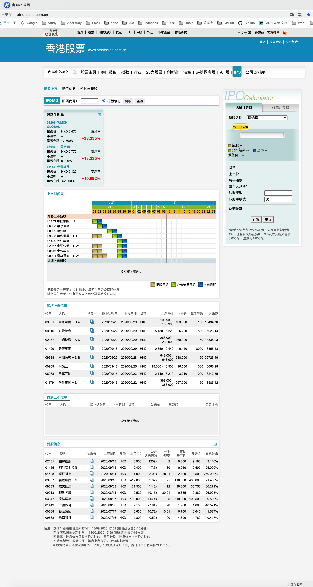
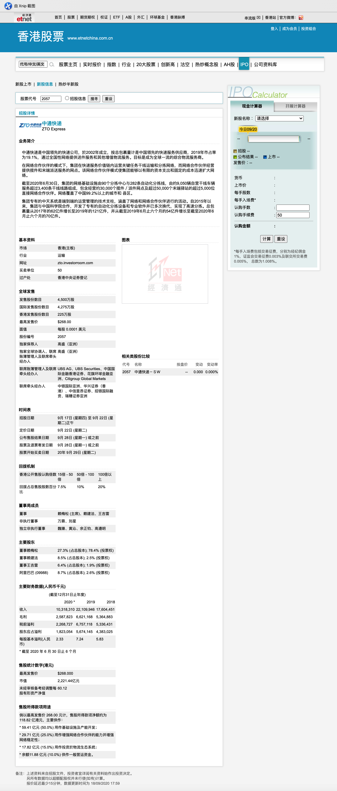
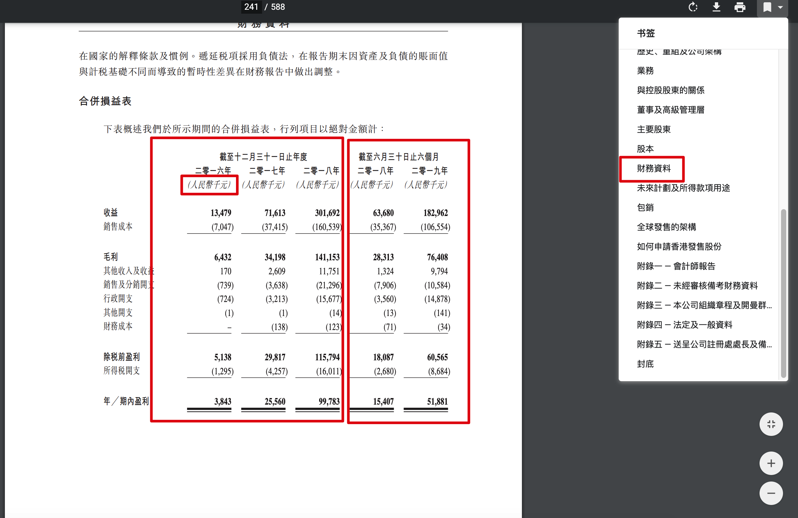
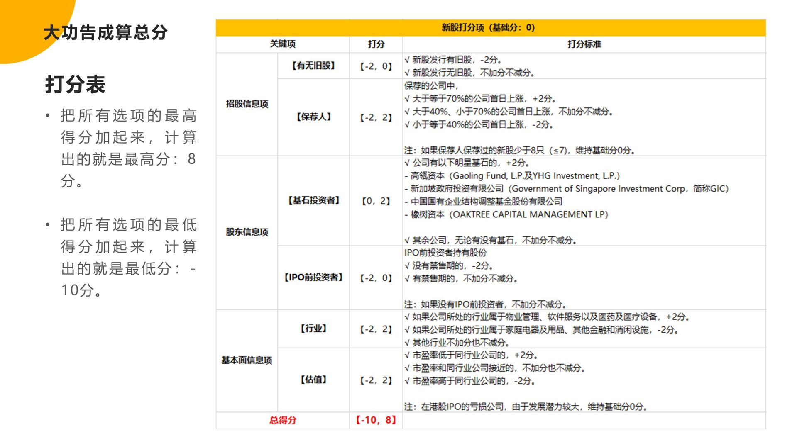

<section id="nice" data-tool="mdnice编辑器" data-website="https://www.mdnice.com" style="font-size: 16px; padding: 0 10px; word-spacing: 0px; word-break: break-word; word-wrap: break-word; text-align: left; line-height: 1.25; color: #2b2b2b; font-family: Optima-Regular, Optima, PingFangTC-Light, PingFangSC-light, PingFangTC-light; letter-spacing: 2px; background-image: linear-gradient(90deg, rgba(50, 0, 0, 0.04) 3%, rgba(0, 0, 0, 0) 3%), linear-gradient(360deg, rgba(50, 0, 0, 0.04) 3%, rgba(0, 0, 0, 0) 3%); background-size: 20px 20px; background-position: center center;"><h1 data-tool="mdnice编辑器" style="margin-top: 30px; margin-bottom: 15px; padding: 0px; font-weight: bold; color: black; font-size: 25px;">港股打新</h1>
<h2 data-tool="mdnice编辑器" style="margin-top: 30px; margin-bottom: 15px; padding: 0px; font-weight: bold; color: black; font-size: 22px; display: block; border-bottom: 4px solid #40B8FA;">为什么打新能赚钱？</h2>
<h3 data-tool="mdnice编辑器" style="padding: 0px; color: black; font-size: 17px; font-weight: bold; text-align: center; position: relative; margin-top: 20px; margin-bottom: 20px;">为什么公司要上市发行股票呢❓</h3>
<ol data-tool="mdnice编辑器" style="margin-top: 8px; margin-bottom: 8px; padding-left: 25px; list-style-type: decimal; font-size: 15px; color: #595959;">
<li><section style="margin-top: 5px; margin-bottom: 5px; line-height: 26px; text-align: left; font-size: 14px; font-weight: normal; color: #595959;">可以募集到大量资金</section></li><li><section style="margin-top: 5px; margin-bottom: 5px; line-height: 26px; text-align: left; font-size: 14px; font-weight: normal; color: #595959;">可以提高公司的知名度</section></li><li><section style="margin-top: 5px; margin-bottom: 5px; line-height: 26px; text-align: left; font-size: 14px; font-weight: normal; color: #595959;">可以吸引更多的投资者</section></li></ol>
<h4 data-tool="mdnice编辑器" style="margin-top: 30px; margin-bottom: 15px; padding: 0px; font-weight: bold; color: black; font-size: 18px;"><strong style="color: #3594F7; font-weight: bold;">「上市」</strong>，意味着公司得把一部分股份拿出来出售给投资者，让更多的人成为公司的股东！</h4>

⏰

<pre class="custom" data-tool="mdnice编辑器" style="margin-top: 10px; margin-bottom: 10px; border-radius: 5px; box-shadow: rgba(0, 0, 0, 0.55) 0px 2px 10px;"><code class="hljs" style="overflow-x: auto; padding: 16px; color: #333; display: -webkit-box; font-family: Operator Mono, Consolas, Monaco, Menlo, monospace; font-size: 12px; -webkit-overflow-scrolling: touch; letter-spacing: 0px; padding-top: 15px; background: #f8f8f8; border-radius: 5px;"> IPO：公司第一次将他的股份向公众出售的这种行为，叫做首次公开慕股（Initial&nbsp;Publish&nbsp;Offering）  </code></pre>

上市之后，证券交易所会要求公司定期公示财务情况，也就是每季度，每半年，每年发布财务报表。

几乎每个IPO市场都会出台有利于投资者的保护政策，吸引大家申购新股。

<strong style="color: #3594F7; font-weight: bold;">「A股市场」</strong>

<pre class="custom" data-tool="mdnice编辑器" style="margin-top: 10px; margin-bottom: 10px; border-radius: 5px; box-shadow: rgba(0, 0, 0, 0.55) 0px 2px 10px;"><code class="hljs" style="overflow-x: auto; padding: 16px; color: #333; display: -webkit-box; font-family: Operator Mono, Consolas, Monaco, Menlo, monospace; font-size: 12px; -webkit-overflow-scrolling: touch; letter-spacing: 0px; padding-top: 15px; background: #f8f8f8; border-radius: 5px;">在A股，证监会就规定，公司不得以高于23倍的市盈率发行新股。“市盈率低于23倍”代表公司的价格普遍便宜，这个政策几乎能确保每个投资者能获利。 </code></pre>

<strong style="color: #3594F7; font-weight: bold;">「港股市场」</strong>

<pre class="custom" data-tool="mdnice编辑器" style="margin-top: 10px; margin-bottom: 10px; border-radius: 5px; box-shadow: rgba(0, 0, 0, 0.55) 0px 2px 10px;"><code class="hljs" style="overflow-x: auto; padding: 16px; color: #333; display: -webkit-box; font-family: Operator Mono, Consolas, Monaco, Menlo, monospace; font-size: 12px; -webkit-overflow-scrolling: touch; letter-spacing: 0px; padding-top: 15px; background: #f8f8f8; border-radius: 5px;">在港股，同样出台了偏向中小投资者的新股分配制度，申购同一只新股，公司会尽可能让所有人都分到一手。 </code></pre>

⚠️ 打新本质上是一种套利行为，属于投机，而不是投资。

打新是为了公司能顺利上市，政府出台新政策，公司让利，吸引我们来申购新股。一旦公司上市成功，这个优惠就会很快消失。

<h3 data-tool="mdnice编辑器" style="padding: 0px; color: black; font-size: 17px; font-weight: bold; text-align: center; position: relative; margin-top: 20px; margin-bottom: 20px;">不是所有的新股都会上涨</h3>

<strong style="color: #3594F7; font-weight: bold;">「破发」</strong>

<pre class="custom" data-tool="mdnice编辑器" style="margin-top: 10px; margin-bottom: 10px; border-radius: 5px; box-shadow: rgba(0, 0, 0, 0.55) 0px 2px 10px;"><code class="hljs" style="overflow-x: auto; padding: 16px; color: #333; display: -webkit-box; font-family: Operator Mono, Consolas, Monaco, Menlo, monospace; font-size: 12px; -webkit-overflow-scrolling: touch; letter-spacing: 0px; padding-top: 15px; background: #f8f8f8; border-radius: 5px;">新股上市之后的涨跌依旧会受到其他因素的影响，比如，公司突然发生什么丑闻，或者上市时卖出的人太多等等。这些负面因素，会对股价造成负面影响，严重的话，则会导致新股上市之后跌破发行价，俗称“破发”。 </code></pre>

根据wind数据统计，全球的IPO市场，新股都是大概率上涨的。

<h2 data-tool="mdnice编辑器" style="margin-top: 30px; margin-bottom: 15px; padding: 0px; font-weight: bold; color: black; font-size: 22px; display: block; border-bottom: 4px solid #40B8FA;">在哪里开始打新策略？</h2>
<ol data-tool="mdnice编辑器" style="margin-top: 8px; margin-bottom: 8px; padding-left: 25px; list-style-type: decimal; font-size: 15px; color: #595959;">
<li><section style="margin-top: 5px; margin-bottom: 5px; line-height: 26px; text-align: left; font-size: 14px; font-weight: normal; color: #595959;"><strong style="color: #3594F7; font-weight: bold;">「看首日上涨的概率」</strong>，A股上市99.999%首日上涨，台湾新股首日上涨率为90%，香港新股首日上涨概率为65%，美股80%首日上涨！</section></li><li><section style="margin-top: 5px; margin-bottom: 5px; line-height: 26px; text-align: left; font-size: 14px; font-weight: normal; color: #595959;"><strong style="color: #3594F7; font-weight: bold;">「中签难度」</strong>，中签的几率对打新来说非常重要，首日上涨最高的A股，中签的几率只有万分之几，港股稍微好点，股票的一手中签率在1%～100%，平均达到60%，随着参与港股打新的人越来越多，几率会有所下降。美股不会公布中签率，但是基本上是好股难中，烂股易中。台股中签难度大，平均中签不到4%。</section></li><li><section style="margin-top: 5px; margin-bottom: 5px; line-height: 26px; text-align: left; font-size: 14px; font-weight: normal; color: #595959;"><strong style="color: #3594F7; font-weight: bold;">「申购新股的资格」</strong>，我们在A股，港股，美股都能开通账户，拥有申购新股的资格，另外，A股有一万元市值的门槛，对股市新手不太友好！</section></li></ol>

<strong style="color: #3594F7; font-weight: bold;">「“炒新”」</strong>

<pre class="custom" data-tool="mdnice编辑器" style="margin-top: 10px; margin-bottom: 10px; border-radius: 5px; box-shadow: rgba(0, 0, 0, 0.55) 0px 2px 10px;"><code class="hljs" style="overflow-x: auto; padding: 16px; color: #333; display: -webkit-box; font-family: Operator Mono, Consolas, Monaco, Menlo, monospace; font-size: 12px; -webkit-overflow-scrolling: touch; letter-spacing: 0px; padding-top: 15px; background: #f8f8f8; border-radius: 5px;">在港股还有一个不具备的优势，那就是对公司炒作自家股票是默许的。 </code></pre>

📖打新的三个特点：

<ol data-tool="mdnice编辑器" style="margin-top: 8px; margin-bottom: 8px; padding-left: 25px; list-style-type: decimal; font-size: 15px; color: #595959;">
<li><section style="margin-top: 5px; margin-bottom: 5px; line-height: 26px; text-align: left; font-size: 14px; font-weight: normal; color: #595959;">收益高</section></li><li><section style="margin-top: 5px; margin-bottom: 5px; line-height: 26px; text-align: left; font-size: 14px; font-weight: normal; color: #595959;">盈利周期短</section></li><li><section style="margin-top: 5px; margin-bottom: 5px; line-height: 26px; text-align: left; font-size: 14px; font-weight: normal; color: #595959;">本金少</section></li></ol>

<h1 data-tool="mdnice编辑器" style="margin-top: 30px; margin-bottom: 15px; padding: 0px; font-weight: bold; color: black; font-size: 25px;">传统券商🆚互联网券商</h1>

相比传统券商来说，互联网券商🈶️三个优点：

<ol data-tool="mdnice编辑器" style="margin-top: 8px; margin-bottom: 8px; padding-left: 25px; list-style-type: decimal; font-size: 15px; color: #595959;">
<li><section style="margin-top: 5px; margin-bottom: 5px; line-height: 26px; text-align: left; font-size: 14px; font-weight: normal; color: #595959;">开会速度快</section></li><li><section style="margin-top: 5px; margin-bottom: 5px; line-height: 26px; text-align: left; font-size: 14px; font-weight: normal; color: #595959;">交易软件好用</section></li><li><section style="margin-top: 5px; margin-bottom: 5px; line-height: 26px; text-align: left; font-size: 14px; font-weight: normal; color: #595959;">佣金优惠</section></li></ol>
<h3 data-tool="mdnice编辑器" style="padding: 0px; color: black; font-size: 17px; font-weight: bold; text-align: center; position: relative; margin-top: 20px; margin-bottom: 20px;">寻找优质券商的三大要素</h3>
<h4 data-tool="mdnice编辑器" style="margin-top: 30px; margin-bottom: 15px; padding: 0px; font-weight: bold; color: black; font-size: 18px;">挑选券商的三大技巧：</h4>
<ol data-tool="mdnice编辑器" style="margin-top: 8px; margin-bottom: 8px; padding-left: 25px; list-style-type: decimal; font-size: 15px; color: #595959;">
<li><section style="margin-top: 5px; margin-bottom: 5px; line-height: 26px; text-align: left; font-size: 14px; font-weight: normal; color: #595959;"><strong style="color: #3594F7; font-weight: bold;">「是否可以融资打新」</strong>，融资打新的意思是我们从券商那里借钱打新，假如一家券商的融资倍数是10，那么1万元可以打10万元的新股，在新股多，但钱不够但时候就派上用场了。</section></li><li><section style="margin-top: 5px; margin-bottom: 5px; line-height: 26px; text-align: left; font-size: 14px; font-weight: normal; color: #595959;"><strong style="color: #3594F7; font-weight: bold;">「费用是否便宜」</strong>，打新需要但费用大致分为2种：</section></li></ol>
<ul data-tool="mdnice编辑器" style="margin-top: 8px; margin-bottom: 8px; padding-left: 25px; font-size: 15px; color: #595959; list-style-type: circle;">
<li><section style="margin-top: 5px; margin-bottom: 5px; line-height: 26px; text-align: left; font-size: 14px; font-weight: normal; color: #595959;">第一种是<strong style="color: #3594F7; font-weight: bold;">「共同费用」</strong>：意思是指所有的券商都一样的费用，这种费用会在打新和新股卖出的时候产生，由香港证券交易所和香港证监会收取，例如：交易费，交易征费等；</section></li><li><section style="margin-top: 5px; margin-bottom: 5px; line-height: 26px; text-align: left; font-size: 14px; font-weight: normal; color: #595959;">第二种是<strong style="color: #3594F7; font-weight: bold;">「差异费用」</strong>，指的是各个券商都不一样的费用，是由他们券商自己定制的，比如说：佣金，平台使用费，认购费，融资利息等。</section></li></ul>
<ol start="3" data-tool="mdnice编辑器" style="margin-top: 8px; margin-bottom: 8px; padding-left: 25px; list-style-type: decimal; font-size: 15px; color: #595959;">
<li><section style="margin-top: 5px; margin-bottom: 5px; line-height: 26px; text-align: left; font-size: 14px; font-weight: normal; color: #595959;"><strong style="color: #3594F7; font-weight: bold;">「是否有暗盘」</strong>，暗盘是券商自己的交易系统，和港交所的正式交易系统类似，有了暗盘，就多一直卖出的选择。</section></li></ol>
<h3 data-tool="mdnice编辑器" style="padding: 0px; color: black; font-size: 17px; font-weight: bold; text-align: center; position: relative; margin-top: 20px; margin-bottom: 20px;">掌握入金操作</h3>
<h4 data-tool="mdnice编辑器" style="margin-top: 30px; margin-bottom: 15px; padding: 0px; font-weight: bold; color: black; font-size: 18px;">钱可以通过银行卡转到交易账户上，这个过程称为入金，反之是出金。</h4>

入金的方式有2种：

<ol data-tool="mdnice编辑器" style="margin-top: 8px; margin-bottom: 8px; padding-left: 25px; list-style-type: decimal; font-size: 15px; color: #595959;">
<li><section style="margin-top: 5px; margin-bottom: 5px; line-height: 26px; text-align: left; font-size: 14px; font-weight: normal; color: #595959;">境内银行卡入金，境内银行卡虽然方便，但是也有缺点：</section></li></ol>
<ul data-tool="mdnice编辑器" style="margin-top: 8px; margin-bottom: 8px; padding-left: 25px; font-size: 15px; color: #595959; list-style-type: circle;">
<li><section style="margin-top: 5px; margin-bottom: 5px; line-height: 26px; text-align: left; font-size: 14px; font-weight: normal; color: #595959;">汇款不是100%成功，汇款过程中无论成败，银行都会收取手续费，如果失败了，可能损失几十甚至几百元</section></li><li><section style="margin-top: 5px; margin-bottom: 5px; line-height: 26px; text-align: left; font-size: 14px; font-weight: normal; color: #595959;">出金很难，各大券商几乎都不支持境内银行卡出金</section></li></ul>
<ol start="2" data-tool="mdnice编辑器" style="margin-top: 8px; margin-bottom: 8px; padding-left: 25px; list-style-type: decimal; font-size: 15px; color: #595959;">
<li><section style="margin-top: 5px; margin-bottom: 5px; line-height: 26px; text-align: left; font-size: 14px; font-weight: normal; color: #595959;">香港本地银行卡入金</section></li></ol>
<ul data-tool="mdnice编辑器" style="margin-top: 8px; margin-bottom: 8px; padding-left: 25px; font-size: 15px; color: #595959; list-style-type: circle;">
<li><section style="margin-top: 5px; margin-bottom: 5px; line-height: 26px; text-align: left; font-size: 14px; font-weight: normal; color: #595959;">优点是：入金速度快，基本当天就可以完成，</section></li><li><section style="margin-top: 5px; margin-bottom: 5px; line-height: 26px; text-align: left; font-size: 14px; font-weight: normal; color: #595959;">缺点是：门槛高需要专门办理。</section></li></ul>

<h3 data-tool="mdnice编辑器" style="padding: 0px; color: black; font-size: 17px; font-weight: bold; text-align: center; position: relative; margin-top: 20px; margin-bottom: 20px;">哪些新股可以打？</h3>
<h4 data-tool="mdnice编辑器" style="margin-top: 30px; margin-bottom: 15px; padding: 0px; font-weight: bold; color: black; font-size: 18px;">专门的网站</h4>
<ol data-tool="mdnice编辑器" style="margin-top: 8px; margin-bottom: 8px; padding-left: 25px; list-style-type: decimal; font-size: 15px; color: #595959;">
<li><section style="margin-top: 5px; margin-bottom: 5px; line-height: 26px; text-align: left; font-size: 14px; font-weight: normal; color: #595959;">
<a href="https://sc.hkexnews.hk/TuniS/www.hkexnews.hk/index_c.htm" style="text-decoration: none; word-wrap: break-word; color: #40B8FA; font-weight: normal; border-bottom: 1px solid #3BAAFA;">(披露易)</a>查看
在披露易网站，点击上方的【新上市】，再点击【新上市资料】，就可以查看最近的招募的新股。

</section></li><li><section style="margin-top: 5px; margin-bottom: 5px; line-height: 26px; text-align: left; font-size: 14px; font-weight: normal; color: #595959;">
在【新上市资料】下，有2个板块，分别是主板和GEM，GEM就是创业板，和A股类似，港股也分主板和创业板，分别对应不同规模的上市公司。

</section></li><li><section style="margin-top: 5px; margin-bottom: 5px; line-height: 26px; text-align: left; font-size: 14px; font-weight: normal; color: #595959;">
点击【GEM】进入创业板主页，再点击【新上市资料】，就可以看到<strong style="color: #3594F7; font-weight: bold;">「即将上市」</strong>的登录创业板的新股。（如果表格中没有数据，那就代表目前没有正在招募的新股）

</section></li><li><section style="margin-top: 5px; margin-bottom: 5px; line-height: 26px; text-align: left; font-size: 14px; font-weight: normal; color: #595959;">
进入披露易网站首页，点击上方的【新上市】，再点击【申请版本，聆讯后资料集及相关资料】可以看到正处于<strong style="color: #3594F7; font-weight: bold;">「上市筹备中」</strong>的公司

</section></li></ol>
<h4 data-tool="mdnice编辑器" style="margin-top: 30px; margin-bottom: 15px; padding: 0px; font-weight: bold; color: black; font-size: 18px;">去券商app（捷利交易宝）查看</h4>
<ol data-tool="mdnice编辑器" style="margin-top: 8px; margin-bottom: 8px; padding-left: 25px; list-style-type: decimal; font-size: 15px; color: #595959;">
<li><section style="margin-top: 5px; margin-bottom: 5px; line-height: 26px; text-align: left; font-size: 14px; font-weight: normal; color: #595959;">打开捷利交易宝app，在首页点击【新股通】，进入港股新股页面。</section></li><li><section style="margin-top: 5px; margin-bottom: 5px; line-height: 26px; text-align: left; font-size: 14px; font-weight: normal; color: #595959;">查看即将上市的新股：在港股新股页面，找到【待上市】这个标题下的公司，就是即将上市的新股了。</section></li><li><section style="margin-top: 5px; margin-bottom: 5px; line-height: 26px; text-align: left; font-size: 14px; font-weight: normal; color: #595959;">查看正在筹备阶段的新股：往下滑动，就可以看见【最新递表】，这一个标题下的新股就是目前<strong style="color: #3594F7; font-weight: bold;">「正在筹备中」</strong>的新股，点击【最新递表】右侧的三个小点，可以看到更加详细的处于筹备阶段的新股列表，新股列表还分为主板和创业板两个板块显示。</section></li></ol>
<h4 data-tool="mdnice编辑器" style="margin-top: 30px; margin-bottom: 15px; padding: 0px; font-weight: bold; color: black; font-size: 18px;">新股的基本情况</h4>
<ol data-tool="mdnice编辑器" style="margin-top: 8px; margin-bottom: 8px; padding-left: 25px; list-style-type: decimal; font-size: 15px; color: #595959;">
<li><section style="margin-top: 5px; margin-bottom: 5px; line-height: 26px; text-align: left; font-size: 14px; font-weight: normal; color: #595959;">首先，是新股的股票名称和上市代号，其次是新股的上市市场--主板还是创业板！</section></li></ol>
<pre class="custom" data-tool="mdnice编辑器" style="margin-top: 10px; margin-bottom: 10px; border-radius: 5px; box-shadow: rgba(0, 0, 0, 0.55) 0px 2px 10px;"><code class="hljs" style="overflow-x: auto; padding: 16px; color: #333; display: -webkit-box; font-family: Operator Mono, Consolas, Monaco, Menlo, monospace; font-size: 12px; -webkit-overflow-scrolling: touch; letter-spacing: 0px; padding-top: 15px; background: #f8f8f8; border-radius: 5px;">主板和创业板最大的区别是对公司市值要求不一样，主板要求公司市值不能少于5亿港元，而创业板只要1.5亿股元，另外创业板是港股专门为中小企业设立的证券市场，公司小风险大，因此股交所对它的监管更加严格，比如要求披露更多的资料。股票代码以“08”开头的都是创业板上市公司。 </code></pre>
<ol start="2" data-tool="mdnice编辑器" style="margin-top: 8px; margin-bottom: 8px; padding-left: 25px; list-style-type: decimal; font-size: 15px; color: #595959;">
<li><section style="margin-top: 5px; margin-bottom: 5px; line-height: 26px; text-align: left; font-size: 14px; font-weight: normal; color: #595959;">
招股时间和上市时间：

2.1 登录<a href="http://www.etnetchina.com.cn/stocks" style="text-decoration: none; word-wrap: break-word; color: #40B8FA; font-weight: normal; border-bottom: 1px solid #3BAAFA;">经济通网站香港股票</a>界面 ,点击页面上的【IPO】,可以看到所有的信息！如下图所示：

2.2 在【即将上市信息】栏下，点击单个股票的名称，可以进入新股的详情信息页面，以中通快递为例，如下图所示，其中的时间表，有招股日期，其中<strong style="color: #3594F7; font-weight: bold;">「股票开始买卖日期」</strong>就是上市日期，

</section></li></ol>
<h3 data-tool="mdnice编辑器" style="padding: 0px; color: black; font-size: 17px; font-weight: bold; text-align: center; position: relative; margin-top: 20px; margin-bottom: 20px;">我们根据哪些关键项目来打分呢？</h3>
<ol data-tool="mdnice编辑器" style="margin-top: 8px; margin-bottom: 8px; padding-left: 25px; list-style-type: decimal; font-size: 15px; color: #595959;">
<li><section style="margin-top: 5px; margin-bottom: 5px; line-height: 26px; text-align: left; font-size: 14px; font-weight: normal; color: #595959;">是否有新瓶装旧酒；</section></li><li><section style="margin-top: 5px; margin-bottom: 5px; line-height: 26px; text-align: left; font-size: 14px; font-weight: normal; color: #595959;">新股背后的推荐人；</section></li><li><section style="margin-top: 5px; margin-bottom: 5px; line-height: 26px; text-align: left; font-size: 14px; font-weight: normal; color: #595959;">新股背后的投资人；</section></li><li><section style="margin-top: 5px; margin-bottom: 5px; line-height: 26px; text-align: left; font-size: 14px; font-weight: normal; color: #595959;">新股的自身实力；</section></li></ol>
<h4 data-tool="mdnice编辑器" style="margin-top: 30px; margin-bottom: 15px; padding: 0px; font-weight: bold; color: black; font-size: 18px;">新瓶装旧酒</h4>

指的就是新股发行的同时，卖掉旧股票。

<h4 data-tool="mdnice编辑器" style="margin-top: 30px; margin-bottom: 15px; padding: 0px; font-weight: bold; color: black; font-size: 18px;">新股背后的推荐人</h4>

新股背后的推荐人是指保荐人机制

<pre class="custom" data-tool="mdnice编辑器" style="margin-top: 10px; margin-bottom: 10px; border-radius: 5px; box-shadow: rgba(0, 0, 0, 0.55) 0px 2px 10px;"><code class="hljs" style="overflow-x: auto; padding: 16px; color: #333; display: -webkit-box; font-family: Operator Mono, Consolas, Monaco, Menlo, monospace; font-size: 12px; -webkit-overflow-scrolling: touch; letter-spacing: 0px; padding-top: 15px; background: #f8f8f8; border-radius: 5px;">港股新股上市之前，必须要指定一位保荐人，保荐人好不好，某种程度上也决定了，新股上市的表现， </code></pre>
<h4 data-tool="mdnice编辑器" style="margin-top: 30px; margin-bottom: 15px; padding: 0px; font-weight: bold; color: black; font-size: 18px;">新股背后的投资人</h4>
<pre class="custom" data-tool="mdnice编辑器" style="margin-top: 10px; margin-bottom: 10px; border-radius: 5px; box-shadow: rgba(0, 0, 0, 0.55) 0px 2px 10px;"><code class="hljs" style="overflow-x: auto; padding: 16px; color: #333; display: -webkit-box; font-family: Operator Mono, Consolas, Monaco, Menlo, monospace; font-size: 12px; -webkit-overflow-scrolling: touch; letter-spacing: 0px; padding-top: 15px; background: #f8f8f8; border-radius: 5px;">新股背后的投资人是指有些新股在上市发行时，部分股份会被投资人事先认购，有些新股在上市发行前就存在投资人，比如&nbsp;：天使投资人，A轮，B轮等，投资人的存在意味着对公司前景的看好，另一方面，我们也要注意他们是否会把股份卖出套现，所以这个情况不能一概而论，需要具体情况具体分析。 </code></pre>
<h4 data-tool="mdnice编辑器" style="margin-top: 30px; margin-bottom: 15px; padding: 0px; font-weight: bold; color: black; font-size: 18px;">新股的自身实力</h4>

新股的自身实力这里的含义比较丰富，比如，公司所处的行业就属于其中之一。

<pre class="custom" data-tool="mdnice编辑器" style="margin-top: 10px; margin-bottom: 10px; border-radius: 5px; box-shadow: rgba(0, 0, 0, 0.55) 0px 2px 10px;"><code class="hljs" style="overflow-x: auto; padding: 16px; color: #333; display: -webkit-box; font-family: Operator Mono, Consolas, Monaco, Menlo, monospace; font-size: 12px; -webkit-overflow-scrolling: touch; letter-spacing: 0px; padding-top: 15px; background: #f8f8f8; border-radius: 5px;">有些港股新股，虽然自身业绩一般般，但是行业热门，受追捧，所以，好的行业对我们来说也是加分项。  </code></pre>

新股卖的贵不贵也值得关注，新股上市，就是要在市场上找买家，公司实力能达到同行的平均水平，但是卖的比同行便宜，就是竞争力。而我们申购新股，自然更加愿意购买便宜的新股，这样新股上涨的空间就会更大。所以<strong style="color: #3594F7; font-weight: bold;">「新股估值」</strong>也是我们需要考虑的一个方面。

总结：

<ol data-tool="mdnice编辑器" style="margin-top: 8px; margin-bottom: 8px; padding-left: 25px; list-style-type: decimal; font-size: 15px; color: #595959;">
<li><section style="margin-top: 5px; margin-bottom: 5px; line-height: 26px; text-align: left; font-size: 14px; font-weight: normal; color: #595959;">【有无旧股】和【保荐人】属于招股信息项</section></li><li><section style="margin-top: 5px; margin-bottom: 5px; line-height: 26px; text-align: left; font-size: 14px; font-weight: normal; color: #595959;">【技石投资者】和【IPO前投资者】属于股东信息项</section></li><li><section style="margin-top: 5px; margin-bottom: 5px; line-height: 26px; text-align: left; font-size: 14px; font-weight: normal; color: #595959;">【行业】和【估值】属于基本面信息项</section></li></ol>

<h3 data-tool="mdnice编辑器" style="padding: 0px; color: black; font-size: 17px; font-weight: bold; text-align: center; position: relative; margin-top: 20px; margin-bottom: 20px;">新瓶装旧酒好不好？</h3>

<strong style="color: #3594F7; font-weight: bold;">「旧股」</strong>：公司在创建时候，为了筹集资本，就把股份卖给了投资人，这部分在上市前卖出的股份。

可能有2种情况：

<ol data-tool="mdnice编辑器" style="margin-top: 8px; margin-bottom: 8px; padding-left: 25px; list-style-type: decimal; font-size: 15px; color: #595959;">
<li><section style="margin-top: 5px; margin-bottom: 5px; line-height: 26px; text-align: left; font-size: 14px; font-weight: normal; color: #595959;">原来的股东继续持有不卖；</section></li><li><section style="margin-top: 5px; margin-bottom: 5px; line-height: 26px; text-align: left; font-size: 14px; font-weight: normal; color: #595959;">老股东选择在新股发行的时候把自己的股票卖出转让给打新者。（有点跑路的意思）</section></li></ol>

👉 新股发行卖旧股属于减分项，减2分，如果没有旧股，则不加分

<h3 data-tool="mdnice编辑器" style="padding: 0px; color: black; font-size: 17px; font-weight: bold; text-align: center; position: relative; margin-top: 20px; margin-bottom: 20px;">招股书</h3>

<strong style="color: #3594F7; font-weight: bold;">「招股书」</strong>也叫做，招股说明书，是公司公开发行股票时候，就招股事宜发布的书面通告。

登录<a href="http://www.etnetchina.com.cn/stocks" style="text-decoration: none; word-wrap: break-word; color: #40B8FA; font-weight: normal; border-bottom: 1px solid #3BAAFA;">经济通</a>网站香港股票界面 ,点击页面上的【IPO】,在【即将上市信息】这一栏，可以看到每个即将上市的招股书。点击即可打开查看，在招股书的【重要提示】下面，可以看到所有的招股信息，以中通为例：

<ol data-tool="mdnice编辑器" style="margin-top: 8px; margin-bottom: 8px; padding-left: 25px; list-style-type: decimal; font-size: 15px; color: #595959;">
<li><section style="margin-top: 5px; margin-bottom: 5px; line-height: 26px; text-align: left; font-size: 14px; font-weight: normal; color: #595959;">全球發售的發售股份數目 ： 45,000,000股發售股份（視乎超額配股權行使與否而定）</section></li><li><section style="margin-top: 5px; margin-bottom: 5px; line-height: 26px; text-align: left; font-size: 14px; font-weight: normal; color: #595959;">香港發售股份數目 ： 2,250,000股發售股份（可予重新分配）</section></li><li><section style="margin-top: 5px; margin-bottom: 5px; line-height: 26px; text-align: left; font-size: 14px; font-weight: normal; color: #595959;">國際發售股份數目 ： 42,750,000股發售股份（可予重新分配及視乎超額配股權行使與否而定）</section></li><li><section style="margin-top: 5px; margin-bottom: 5px; line-height: 26px; text-align: left; font-size: 14px; font-weight: normal; color: #595959;">最高公開發售價 ： 每股發售股份268.00港元，另加1.0%經紀佣金、0.0027%香港證監會交易徵費以及0.005%香港聯交所交易費（須於申請時以港元繳足，多繳款項可退還）</section></li><li><section style="margin-top: 5px; margin-bottom: 5px; line-height: 26px; text-align: left; font-size: 14px; font-weight: normal; color: #595959;">面值 ： 每股股份0.0001美元</section></li><li><section style="margin-top: 5px; margin-bottom: 5px; line-height: 26px; text-align: left; font-size: 14px; font-weight: normal; color: #595959;">股份代號 ： 2057</section></li><li><section style="margin-top: 5px; margin-bottom: 5px; line-height: 26px; text-align: left; font-size: 14px; font-weight: normal; color: #595959;">獨家保薦人、獨家全球協調人、聯席賬簿管理人及聯席牽頭經辦人</section></li></ol>

从以上的资料可以看出，中通没有旧股发行！在手机app<strong style="color: #3594F7; font-weight: bold;">「捷利交易宝」</strong>上也可以查看到！

如果上有旧股发行的新股会是如下情况👇
全球發售的發售股份數目 ： 352,700,000股股份（包括310,300,000股新股份
及<strong style="color: #3594F7; font-weight: bold;">「42,400,000股銷售股份」</strong>，視乎超額配股權
行使與否而定）
<strong style="color: #3594F7; font-weight: bold;">「其中42,400,000股銷售股份，就是旧股，减分项」</strong>。

<h3 data-tool="mdnice编辑器" style="padding: 0px; color: black; font-size: 17px; font-weight: bold; text-align: center; position: relative; margin-top: 20px; margin-bottom: 20px;">保荐人是否靠谱</h3>

保荐人

<pre class="custom" data-tool="mdnice编辑器" style="margin-top: 10px; margin-bottom: 10px; border-radius: 5px; box-shadow: rgba(0, 0, 0, 0.55) 0px 2px 10px;"><code class="hljs" style="overflow-x: auto; padding: 16px; color: #333; display: -webkit-box; font-family: Operator Mono, Consolas, Monaco, Menlo, monospace; font-size: 12px; -webkit-overflow-scrolling: touch; letter-spacing: 0px; padding-top: 15px; background: #f8f8f8; border-radius: 5px;">简单点理解，保荐人就是公司上市的推荐人和担保人，通常由证券公司来承担这一角色，要获得保荐人资格，申请机构需要经过长达数月的审批流程和严格塞选。 在新股破发的时候，保荐人能够以不高于发行价的价格，低价买回市场上流通的新股股票，然后还给战略投资人。 </code></pre>

靠谱的保荐人，在护盘的时候，会表现的比较积极，靠谱保荐人的持续买入，股价会稳定在一个较小的波动区间，不靠谱的推荐人就会假装没有看见，护盘不积极不说，有些甚至任由投资者集中卖出。

根据资金背景不同，保荐人可以分为三种：

<ol data-tool="mdnice编辑器" style="margin-top: 8px; margin-bottom: 8px; padding-left: 25px; list-style-type: decimal; font-size: 15px; color: #595959;">
<li><section style="margin-top: 5px; margin-bottom: 5px; line-height: 26px; text-align: left; font-size: 14px; font-weight: normal; color: #595959;">中资券商（中信里昂，建银国际）</section></li><li><section style="margin-top: 5px; margin-bottom: 5px; line-height: 26px; text-align: left; font-size: 14px; font-weight: normal; color: #595959;">外资券商（高盛，摩根斯坦利）</section></li><li><section style="margin-top: 5px; margin-bottom: 5px; line-height: 26px; text-align: left; font-size: 14px; font-weight: normal; color: #595959;">港资券商（创升融资，丰盛融资）</section></li></ol>
<h4 data-tool="mdnice编辑器" style="margin-top: 30px; margin-bottom: 15px; padding: 0px; font-weight: bold; color: black; font-size: 18px;">推荐人是否靠谱需要拿过往业绩说话</h4>

如果他保荐的新股，上市首日上涨多，破发少，那么我们跟着他可能有肉吃，自然是比较靠谱的；

<strong style="color: #3594F7; font-weight: bold;">「保荐人打分标准」</strong>

<ol data-tool="mdnice编辑器" style="margin-top: 8px; margin-bottom: 8px; padding-left: 25px; list-style-type: decimal; font-size: 15px; color: #595959;">
<li><section style="margin-top: 5px; margin-bottom: 5px; line-height: 26px; text-align: left; font-size: 14px; font-weight: normal; color: #595959;">如果保荐的公司中，有占比&gt;70%的公司首日上涨，则认为保荐人业绩优秀；</section></li><li><section style="margin-top: 5px; margin-bottom: 5px; line-height: 26px; text-align: left; font-size: 14px; font-weight: normal; color: #595959;">如果保荐的公司中，有占比40%～70%的公司首日上涨，则认为保荐人业绩居中；</section></li><li><section style="margin-top: 5px; margin-bottom: 5px; line-height: 26px; text-align: left; font-size: 14px; font-weight: normal; color: #595959;">如果保荐的公司中，有占比&lt;40%的公司首日上涨，则认为保荐人业绩较差，减2分；</section></li></ol>
<h4 data-tool="mdnice编辑器" style="margin-top: 30px; margin-bottom: 15px; padding: 0px; font-weight: bold; color: black; font-size: 18px;">怎么查看保荐人过往信息和业绩？</h4>

在捷利交易宝App里，任何一只新股的【简介】标签下，就能看到【保荐人】这项。点击蓝色的保荐人名字，就能查看他们的历史业绩。

保荐成绩（新股上涨率） = 上涨的新股数 / 总共保荐的新股数

<h3 data-tool="mdnice编辑器" style="padding: 0px; color: black; font-size: 17px; font-weight: bold; text-align: center; position: relative; margin-top: 20px; margin-bottom: 20px;">看后台</h3>
<h4 data-tool="mdnice编辑器" style="margin-top: 30px; margin-bottom: 15px; padding: 0px; font-weight: bold; color: black; font-size: 18px;">基石投资者</h4>

基石投资者就是在IPO时，提前和发行人签订认购协议，以IPO的价格，也就是新股发行的价格认购一定股票数量的投资者，基石投资者认购的股票通常会有6～12个月的锁定期。
签订协议的时候，新股的发行价格是未知的，即使如此，基石投资者也愿意购买，体现了其坚定的信心。

<h4 data-tool="mdnice编辑器" style="margin-top: 30px; margin-bottom: 15px; padding: 0px; font-weight: bold; color: black; font-size: 18px;">基石投资者队伍</h4>

第一队：高瓴资本（Gaoling Fund, L.p.），新加坡政府投资有限公司（GIC），中国国有企业结构调整基金股份有限公司和橡树资本，英文名，OAKTREE CAPITAL MANAGEMENTLP
第二队：普通企业或者个人投资者，经过对2019年对港股市场的数据回溯，发现普通基石投资者，对于降低新股破发概率的作用能力有限，所以，由这些投资者做基石投资者的公司，我们就和没有基石投资者的新股一样处理，不加分不减分！

<h3 data-tool="mdnice编辑器" style="padding: 0px; color: black; font-size: 17px; font-weight: bold; text-align: center; position: relative; margin-top: 20px; margin-bottom: 20px;">IPO前的投资者</h3>

IPO前投资者（VC，A轮投资者等）和基石投资者的区别：

<ol data-tool="mdnice编辑器" style="margin-top: 8px; margin-bottom: 8px; padding-left: 25px; list-style-type: decimal; font-size: 15px; color: #595959;">
<li><section style="margin-top: 5px; margin-bottom: 5px; line-height: 26px; text-align: left; font-size: 14px; font-weight: normal; color: #595959;">二者的进入时间不一样，IPO前投资者是在公司上市前进入的，而基石投资者是在IPO时进入的，后者属于IPO投资者。</section></li><li><section style="margin-top: 5px; margin-bottom: 5px; line-height: 26px; text-align: left; font-size: 14px; font-weight: normal; color: #595959;">基石投资者买到的价格是IPO的价格，也就是新股发行价，而IPO前投资者买到的股票价格可不是发行价。</section></li></ol>

对于打新来说，应该关注【IPO前投资者】哪些方面？
鉴于IPO前投资者的成本低，只要IPO价格合理，就可以完成套现离场，因此，我们要重点关注的是，在上市首日那天，是否被运行卖股票。

<strong style="color: #3594F7; font-weight: bold;">「IPO前投资者打分标准」</strong>：IPO前投资者持有股份，如果有禁售期，不加分不减分，如果没有禁售期，减2分。

在【招股书】中的 <strong style="color: #3594F7; font-weight: bold;">「歷史、重組及公司架構」</strong>这一页可以看见禁售期这项，以<a href="http://www.etnet.com.hk/corpan_cache/get_file.php?n=d755EWRu2kx5UEhu16zZm8fHdfONfUPwtkVrikKcuuBJWpMHo7YyhuVwOc0ihG7CixnQA1gSEcpwa0W0TB5vv50" style="text-decoration: none; word-wrap: break-word; color: #40B8FA; font-weight: normal; border-bottom: 1px solid #3BAAFA;">驴技科技</a>,公司股票代码为[01745]为例,可以看见，部分股东有禁售期，其他的没有禁售期。

<h3 data-tool="mdnice编辑器" style="padding: 0px; color: black; font-size: 17px; font-weight: bold; text-align: center; position: relative; margin-top: 20px; margin-bottom: 20px;">行业信息打分标准</h3>

从2019年港港新港数据来看，物流管理，软件服务以及医疗和医疗设备，比较受行业的青睐。
对于【行业】这项的打分，需要根据市场动向灵活变换。但是行业信息哪里找呢？

<ol data-tool="mdnice编辑器" style="margin-top: 8px; margin-bottom: 8px; padding-left: 25px; list-style-type: decimal; font-size: 15px; color: #595959;">
<li><section style="margin-top: 5px; margin-bottom: 5px; line-height: 26px; text-align: left; font-size: 14px; font-weight: normal; color: #595959;"><a href="http://www.etnetchina.com.cn/stocks" style="text-decoration: none; word-wrap: break-word; color: #40B8FA; font-weight: normal; border-bottom: 1px solid #3BAAFA;">经济通</a>，进入网站=&gt;点击【IPO】=&gt;输入【股票代码】=&gt;点击【搜寻】=&gt;点击【代号】=&gt;进入【基本信息】界面,就能看见所属【行业】</section></li><li><section style="margin-top: 5px; margin-bottom: 5px; line-height: 26px; text-align: left; font-size: 14px; font-weight: normal; color: #595959;">也可以在【招股书】中的【行业概览】中查看</section></li></ol>

<h3 data-tool="mdnice编辑器" style="padding: 0px; color: black; font-size: 17px; font-weight: bold; text-align: center; position: relative; margin-top: 20px; margin-bottom: 20px;">估值计算要牢记</h3>

判断公司是否便宜：

<ol data-tool="mdnice编辑器" style="margin-top: 8px; margin-bottom: 8px; padding-left: 25px; list-style-type: decimal; font-size: 15px; color: #595959;">
<li><section style="margin-top: 5px; margin-bottom: 5px; line-height: 26px; text-align: left; font-size: 14px; font-weight: normal; color: #595959;">算出新股发行时候的市盈率；</section></li><li><section style="margin-top: 5px; margin-bottom: 5px; line-height: 26px; text-align: left; font-size: 14px; font-weight: normal; color: #595959;">找到和新股同一个行业的公司并且查看他们的市盈率；</section></li><li><section style="margin-top: 5px; margin-bottom: 5px; line-height: 26px; text-align: left; font-size: 14px; font-weight: normal; color: #595959;">把新股市盈率和同行业的其他公司的市盈率进行对比，判断新股的估值是贵还是便宜。</section></li></ol>

如果市盈率低于同行的 +2分，市盈率接近的不加分不减分，市盈率高于同行的，-2分。

<h4 data-tool="mdnice编辑器" style="margin-top: 30px; margin-bottom: 15px; padding: 0px; font-weight: bold; color: black; font-size: 18px;">算出新股发行时候的市盈率</h4>

下图是在新股【招股书】上的截图，注意看下图的红色圈出来的，左边是截至12月31日就是全年净利润 ，右边是截至6月30日就是半年净利润，单位是千元，也就是说2018年上半年的净利润是 15407*1000元港币。  

中间市值：（最高市值+最低市值）/ 2

市盈率（PE） = 市值 / 净利润

<ol data-tool="mdnice编辑器" style="margin-top: 8px; margin-bottom: 8px; padding-left: 25px; list-style-type: decimal; font-size: 15px; color: #595959;">
<li><section style="margin-top: 5px; margin-bottom: 5px; line-height: 26px; text-align: left; font-size: 14px; font-weight: normal; color: #595959;">第一种（静市盈率）是以全年的净利润数据来计算：市盈率 = 中间市值 / 2019年全年净利润</section></li><li><section style="margin-top: 5px; margin-bottom: 5px; line-height: 26px; text-align: left; font-size: 14px; font-weight: normal; color: #595959;">第二种（TTM也就是滚动市盈率）是：市盈率 = 中间市值/（2018年下半年净利润+2019上半年净利润）</section></li></ol>
<pre class="custom" data-tool="mdnice编辑器" style="margin-top: 10px; margin-bottom: 10px; border-radius: 5px; box-shadow: rgba(0, 0, 0, 0.55) 0px 2px 10px;"><code class="hljs" style="overflow-x: auto; padding: 16px; color: #333; display: -webkit-box; font-family: Operator Mono, Consolas, Monaco, Menlo, monospace; font-size: 12px; -webkit-overflow-scrolling: touch; letter-spacing: 0px; padding-top: 15px; background: #f8f8f8; border-radius: 5px;">在最近一年净利润数据可以获取的情况下，用第二种方法计算更加准确，第一种计算也行。 </code></pre>
<h4 data-tool="mdnice编辑器" style="margin-top: 30px; margin-bottom: 15px; padding: 0px; font-weight: bold; color: black; font-size: 18px;">找到和新股同一个行业的公司并且查看他们的市盈率</h4>

在经济通网站上，找到这只新股的【新股信息】界面，往下滑动，寻找右侧的【相关类股份比较】，就能看到同行的信息，选择3～5只同行，分别查看他们的市盈率是多少。同行市盈率可以在<strong style="color: #3594F7; font-weight: bold;">「富途App」</strong>上输入对应的股票代码进行查看

⚠️注意：比较的时候，一定要在同一时间进行比较，要不然没有意义。

最后将新股市盈率和同行市盈率由高到低进行估值比较，如果同行中市盈率排名最低可以➕2分。

<figure data-tool="mdnice编辑器" style="margin: 0; margin-top: 10px; margin-bottom: 10px; display: flex; flex-direction: column; justify-content: center; align-items: center;"><figcaption style="margin-top: 5px; text-align: center; display: block; font-size: 13px; color: #2b2b2b;">image</figcaption></figure>

<strong style="color: #3594F7; font-weight: bold;">「如果遇一些打分比较低的公司，但是前景发展比较好（比如阿里巴巴，九毛九等 ），可以给0分。」</strong>

<h4 data-tool="mdnice编辑器" style="margin-top: 30px; margin-bottom: 15px; padding: 0px; font-weight: bold; color: black; font-size: 18px;">总结</h4>

如果你是激进类型的，可以在新股打分是-2分的时候，进行打新，如果是保守的可以在0分以上进行打新。

<h3 data-tool="mdnice编辑器" style="padding: 0px; color: black; font-size: 17px; font-weight: bold; text-align: center; position: relative; margin-top: 20px; margin-bottom: 20px;">打一手新股需要多少钱💰？</h3>

在券商app上，进入你想购买的这只新股的页面，有点需要注意：

<ol data-tool="mdnice编辑器" style="margin-top: 8px; margin-bottom: 8px; padding-left: 25px; list-style-type: decimal; font-size: 15px; color: #595959;">
<li><section style="margin-top: 5px; margin-bottom: 5px; line-height: 26px; text-align: left; font-size: 14px; font-weight: normal; color: #595959;">招股价：招股价显示的是一个区间，分别是上限和下限，最终的发行价是这个区间中的一个值，但是这个值具体是多少，在申购的时候并不知道。</section></li><li><section style="margin-top: 5px; margin-bottom: 5px; line-height: 26px; text-align: left; font-size: 14px; font-weight: normal; color: #595959;">每手股数：就是每股多少股的意思，A股每手100股 ，但是港股不是，港股每手股数由发行人说了算。一般是在100～20000之间</section></li><li><section style="margin-top: 5px; margin-bottom: 5px; line-height: 26px; text-align: left; font-size: 14px; font-weight: normal; color: #595959;">最低认购：俗称“入场费”，也就是申购一手所需要的钱</section></li></ol>

以“兴业物联”为例：

<pre class="custom" data-tool="mdnice编辑器" style="margin-top: 10px; margin-bottom: 10px; border-radius: 5px; box-shadow: rgba(0, 0, 0, 0.55) 0px 2px 10px;"><code class="hljs" style="overflow-x: auto; padding: 16px; color: #333; display: -webkit-box; font-family: Operator Mono, Consolas, Monaco, Menlo, monospace; font-size: 12px; -webkit-overflow-scrolling: touch; letter-spacing: 0px; padding-top: 15px; background: #f8f8f8; border-radius: 5px;">定价上限是2元&nbsp;X&nbsp;每手2000股&nbsp;=&nbsp;入场费4000&nbsp;元 中签费&nbsp;=&nbsp;中签的最高市值4000元（即入场费）&nbsp;x&nbsp;1.0027%&nbsp;=&nbsp;40.31元 1.0027%&nbsp;=&nbsp;1%的经济佣金&nbsp;+&nbsp;0.0027%是监证费&nbsp;+&nbsp;0.005%是联交所交易费用 这笔中签费会在申购的时候，由券商一并冻结，中签后会交给港交所和证监会。 </code></pre>

入场费 = 招股价上限 x 每手股数 + 中签费

<strong style="color: #3594F7; font-weight: bold;">「所以入场费：（1+1.0077%）x 招股价上限 x 每手股数」</strong>

但是，这 并不是最终要交的钱，还要在入场费基础上加上<strong style="color: #3594F7; font-weight: bold;">「认购手续费」</strong>，一般是50港币左右 ！

如果中签了，公司发行价就能确定好了，入场费中结余的钱会退回到你的账户上 。如果没有中签，券商会把入场费原封不动的退回给你。<strong style="color: #3594F7; font-weight: bold;">「但是无论是否中签，券商都会收取认购手续费」</strong>

<pre class="custom" data-tool="mdnice编辑器" style="margin-top: 10px; margin-bottom: 10px; border-radius: 5px; box-shadow: rgba(0, 0, 0, 0.55) 0px 2px 10px;"><code class="hljs" style="overflow-x: auto; padding: 16px; color: #333; display: -webkit-box; font-family: Operator Mono, Consolas, Monaco, Menlo, monospace; font-size: 12px; -webkit-overflow-scrolling: touch; letter-spacing: 0px; padding-top: 15px; background: #f8f8f8; border-radius: 5px;">融资认购：就是借钱申购，虽然能提高中签率，但是，如果新股破发，会有强行平仓的风险。 </code></pre>

什么是强行平仓？

当你借钱申购的新股破发了，券商会担心你还不上钱，通常会让你先追加保证金，如果保证金无法及时到位，就会替代你把全部股票卖掉还钱。

所以：对于新手打新来说，还是<strong style="color: #3594F7; font-weight: bold;">「现金认购」</strong>比较好。一般保守一点，建议申购<strong style="color: #3594F7; font-weight: bold;">「一手」</strong>比较好！

<h3 data-tool="mdnice编辑器" style="padding: 0px; color: black; font-size: 17px; font-weight: bold; text-align: center; position: relative; margin-top: 20px; margin-bottom: 20px;">招股期会发生一些什么事情呢？</h3>
<ol data-tool="mdnice编辑器" style="margin-top: 8px; margin-bottom: 8px; padding-left: 25px; list-style-type: decimal; font-size: 15px; color: #595959;">
<li><section style="margin-top: 5px; margin-bottom: 5px; line-height: 26px; text-align: left; font-size: 14px; font-weight: normal; color: #595959;">孖展</section></li></ol>

“孖展”一词来自香港，英文为Margin，即<a href="https://baike.baidu.com/item/%E4%BF%9D%E8%AF%81%E9%87%91/650093" style="text-decoration: none; word-wrap: break-word; color: #40B8FA; font-weight: normal; border-bottom: 1px solid #3BAAFA;">保证金</a>的意思。在香港市场上，银行和<a href="https://baike.baidu.com/item/%E8%AF%81%E5%88%B8%E5%85%AC%E5%8F%B8/2451707" style="text-decoration: none; word-wrap: break-word; color: #40B8FA; font-weight: normal; border-bottom: 1px solid #3BAAFA;">证券公司</a>一般向投资者提供融资服务。开设了“孖展账户”的投资者，在进行股票买卖时，可利用他们提供的融资额进行杠杆投资，放大收益。一般情况下，证券行或银行向投资者提供这种服务会收取一定的利息。

在招股期间，有个和孖展相关的信息需要我们关注，那就是<strong style="color: #3594F7; font-weight: bold;">「孖展倍数」</strong>，所谓孖展倍数，就是在招股期内，券商总共借给投资者的钱，比上公开发售集资额的倍数，然后减去一，因此也叫做超购倍数 。这个数字意味着新股的热门程度。

一般来说超购倍数超过100倍算是比较高的，这个指标在捷利交易宝app中可以看到。

<ol start="2" data-tool="mdnice编辑器" style="margin-top: 8px; margin-bottom: 8px; padding-left: 25px; list-style-type: decimal; font-size: 15px; color: #595959;">
<li><section style="margin-top: 5px; margin-bottom: 5px; line-height: 26px; text-align: left; font-size: 14px; font-weight: normal; color: #595959;">抽飞</section></li></ol>

也就是取消认购的意思，不买了。如果一只新股在你购买之后的招股期内，发现孖展显示借出的金额相比购买的时候骤降了1亿元以上，那么，可能是发生抽飞了，也是市场对这个新股由看好到看淡的转变，那么需要重新估价打分，考虑是否需要撤销申购！

<h1 data-tool="mdnice编辑器" style="margin-top: 30px; margin-bottom: 15px; padding: 0px; font-weight: bold; color: black; font-size: 25px;">港股打新</h1>
<h2 data-tool="mdnice编辑器" style="margin-top: 30px; margin-bottom: 15px; padding: 0px; font-weight: bold; color: black; font-size: 22px; display: block; border-bottom: 4px solid #40B8FA;">为什么打新能赚钱？</h2>
<h3 data-tool="mdnice编辑器" style="padding: 0px; color: black; font-size: 17px; font-weight: bold; text-align: center; position: relative; margin-top: 20px; margin-bottom: 20px;">为什么公司要上市发行股票呢❓</h3>
<ol data-tool="mdnice编辑器" style="margin-top: 8px; margin-bottom: 8px; padding-left: 25px; list-style-type: decimal; font-size: 15px; color: #595959;">
<li><section style="margin-top: 5px; margin-bottom: 5px; line-height: 26px; text-align: left; font-size: 14px; font-weight: normal; color: #595959;">可以募集到大量资金</section></li><li><section style="margin-top: 5px; margin-bottom: 5px; line-height: 26px; text-align: left; font-size: 14px; font-weight: normal; color: #595959;">可以提高公司的知名度</section></li><li><section style="margin-top: 5px; margin-bottom: 5px; line-height: 26px; text-align: left; font-size: 14px; font-weight: normal; color: #595959;">可以吸引更多的投资者</section></li></ol>
<h4 data-tool="mdnice编辑器" style="margin-top: 30px; margin-bottom: 15px; padding: 0px; font-weight: bold; color: black; font-size: 18px;"><strong style="color: #3594F7; font-weight: bold;">「上市」</strong>，意味着公司得把一部分股份拿出来出售给投资者，让更多的人成为公司的股东！</h4>

⏰

<pre class="custom" data-tool="mdnice编辑器" style="margin-top: 10px; margin-bottom: 10px; border-radius: 5px; box-shadow: rgba(0, 0, 0, 0.55) 0px 2px 10px;"><code class="hljs" style="overflow-x: auto; padding: 16px; color: #333; display: -webkit-box; font-family: Operator Mono, Consolas, Monaco, Menlo, monospace; font-size: 12px; -webkit-overflow-scrolling: touch; letter-spacing: 0px; padding-top: 15px; background: #f8f8f8; border-radius: 5px;"> IPO：公司第一次将他的股份向公众出售的这种行为，叫做首次公开慕股（Initial&nbsp;Publish&nbsp;Offering）  </code></pre>

上市之后，证券交易所会要求公司定期公示财务情况，也就是每季度，每半年，每年发布财务报表。

几乎每个IPO市场都会出台有利于投资者的保护政策，吸引大家申购新股。

<strong style="color: #3594F7; font-weight: bold;">「A股市场」</strong>

<pre class="custom" data-tool="mdnice编辑器" style="margin-top: 10px; margin-bottom: 10px; border-radius: 5px; box-shadow: rgba(0, 0, 0, 0.55) 0px 2px 10px;"><code class="hljs" style="overflow-x: auto; padding: 16px; color: #333; display: -webkit-box; font-family: Operator Mono, Consolas, Monaco, Menlo, monospace; font-size: 12px; -webkit-overflow-scrolling: touch; letter-spacing: 0px; padding-top: 15px; background: #f8f8f8; border-radius: 5px;">在A股，证监会就规定，公司不得以高于23倍的市盈率发行新股。“市盈率低于23倍”代表公司的价格普遍便宜，这个政策几乎能确保每个投资者能获利。 </code></pre>

<strong style="color: #3594F7; font-weight: bold;">「港股市场」</strong>

<pre class="custom" data-tool="mdnice编辑器" style="margin-top: 10px; margin-bottom: 10px; border-radius: 5px; box-shadow: rgba(0, 0, 0, 0.55) 0px 2px 10px;"><code class="hljs" style="overflow-x: auto; padding: 16px; color: #333; display: -webkit-box; font-family: Operator Mono, Consolas, Monaco, Menlo, monospace; font-size: 12px; -webkit-overflow-scrolling: touch; letter-spacing: 0px; padding-top: 15px; background: #f8f8f8; border-radius: 5px;">在港股，同样出台了偏向中小投资者的新股分配制度，申购同一只新股，公司会尽可能让所有人都分到一手。 </code></pre>

⚠️ 打新本质上是一种套利行为，属于投机，而不是投资。

打新是为了公司能顺利上市，政府出台新政策，公司让利，吸引我们来申购新股。一旦公司上市成功，这个优惠就会很快消失。

<h3 data-tool="mdnice编辑器" style="padding: 0px; color: black; font-size: 17px; font-weight: bold; text-align: center; position: relative; margin-top: 20px; margin-bottom: 20px;">不是所有的新股都会上涨</h3>

<strong style="color: #3594F7; font-weight: bold;">「破发」</strong>

<pre class="custom" data-tool="mdnice编辑器" style="margin-top: 10px; margin-bottom: 10px; border-radius: 5px; box-shadow: rgba(0, 0, 0, 0.55) 0px 2px 10px;"><code class="hljs" style="overflow-x: auto; padding: 16px; color: #333; display: -webkit-box; font-family: Operator Mono, Consolas, Monaco, Menlo, monospace; font-size: 12px; -webkit-overflow-scrolling: touch; letter-spacing: 0px; padding-top: 15px; background: #f8f8f8; border-radius: 5px;">新股上市之后的涨跌依旧会受到其他因素的影响，比如，公司突然发生什么丑闻，或者上市时卖出的人太多等等。这些负面因素，会对股价造成负面影响，严重的话，则会导致新股上市之后跌破发行价，俗称“破发”。 </code></pre>

根据wind数据统计，全球的IPO市场，新股都是大概率上涨的。

<h2 data-tool="mdnice编辑器" style="margin-top: 30px; margin-bottom: 15px; padding: 0px; font-weight: bold; color: black; font-size: 22px; display: block; border-bottom: 4px solid #40B8FA;">在哪里开始打新策略？</h2>
<ol data-tool="mdnice编辑器" style="margin-top: 8px; margin-bottom: 8px; padding-left: 25px; list-style-type: decimal; font-size: 15px; color: #595959;">
<li><section style="margin-top: 5px; margin-bottom: 5px; line-height: 26px; text-align: left; font-size: 14px; font-weight: normal; color: #595959;"><strong style="color: #3594F7; font-weight: bold;">「看首日上涨的概率」</strong>，A股上市99.999%首日上涨，台湾新股首日上涨率为90%，香港新股首日上涨概率为65%，美股80%首日上涨！</section></li><li><section style="margin-top: 5px; margin-bottom: 5px; line-height: 26px; text-align: left; font-size: 14px; font-weight: normal; color: #595959;"><strong style="color: #3594F7; font-weight: bold;">「中签难度」</strong>，中签的几率对打新来说非常重要，首日上涨最高的A股，中签的几率只有万分之几，港股稍微好点，股票的一手中签率在1%～100%，平均达到60%，随着参与港股打新的人越来越多，几率会有所下降。美股不会公布中签率，但是基本上是好股难中，烂股易中。台股中签难度大，平均中签不到4%。</section></li><li><section style="margin-top: 5px; margin-bottom: 5px; line-height: 26px; text-align: left; font-size: 14px; font-weight: normal; color: #595959;"><strong style="color: #3594F7; font-weight: bold;">「申购新股的资格」</strong>，我们在A股，港股，美股都能开通账户，拥有申购新股的资格，另外，A股有一万元市值的门槛，对股市新手不太友好！</section></li></ol>

<strong style="color: #3594F7; font-weight: bold;">「“炒新”」</strong>

<pre class="custom" data-tool="mdnice编辑器" style="margin-top: 10px; margin-bottom: 10px; border-radius: 5px; box-shadow: rgba(0, 0, 0, 0.55) 0px 2px 10px;"><code class="hljs" style="overflow-x: auto; padding: 16px; color: #333; display: -webkit-box; font-family: Operator Mono, Consolas, Monaco, Menlo, monospace; font-size: 12px; -webkit-overflow-scrolling: touch; letter-spacing: 0px; padding-top: 15px; background: #f8f8f8; border-radius: 5px;">在港股还有一个不具备的优势，那就是对公司炒作自家股票是默许的。 </code></pre>

📖打新的三个特点：

<ol data-tool="mdnice编辑器" style="margin-top: 8px; margin-bottom: 8px; padding-left: 25px; list-style-type: decimal; font-size: 15px; color: #595959;">
<li><section style="margin-top: 5px; margin-bottom: 5px; line-height: 26px; text-align: left; font-size: 14px; font-weight: normal; color: #595959;">收益高</section></li><li><section style="margin-top: 5px; margin-bottom: 5px; line-height: 26px; text-align: left; font-size: 14px; font-weight: normal; color: #595959;">盈利周期短</section></li><li><section style="margin-top: 5px; margin-bottom: 5px; line-height: 26px; text-align: left; font-size: 14px; font-weight: normal; color: #595959;">本金少</section></li></ol>

<h1 data-tool="mdnice编辑器" style="margin-top: 30px; margin-bottom: 15px; padding: 0px; font-weight: bold; color: black; font-size: 25px;">传统券商🆚互联网券商</h1>

相比传统券商来说，互联网券商🈶️三个优点：

<ol data-tool="mdnice编辑器" style="margin-top: 8px; margin-bottom: 8px; padding-left: 25px; list-style-type: decimal; font-size: 15px; color: #595959;">
<li><section style="margin-top: 5px; margin-bottom: 5px; line-height: 26px; text-align: left; font-size: 14px; font-weight: normal; color: #595959;">开会速度快</section></li><li><section style="margin-top: 5px; margin-bottom: 5px; line-height: 26px; text-align: left; font-size: 14px; font-weight: normal; color: #595959;">交易软件好用</section></li><li><section style="margin-top: 5px; margin-bottom: 5px; line-height: 26px; text-align: left; font-size: 14px; font-weight: normal; color: #595959;">佣金优惠</section></li></ol>
<h3 data-tool="mdnice编辑器" style="padding: 0px; color: black; font-size: 17px; font-weight: bold; text-align: center; position: relative; margin-top: 20px; margin-bottom: 20px;">寻找优质券商的三大要素</h3>
<h4 data-tool="mdnice编辑器" style="margin-top: 30px; margin-bottom: 15px; padding: 0px; font-weight: bold; color: black; font-size: 18px;">挑选券商的三大技巧：</h4>
<ol data-tool="mdnice编辑器" style="margin-top: 8px; margin-bottom: 8px; padding-left: 25px; list-style-type: decimal; font-size: 15px; color: #595959;">
<li><section style="margin-top: 5px; margin-bottom: 5px; line-height: 26px; text-align: left; font-size: 14px; font-weight: normal; color: #595959;"><strong style="color: #3594F7; font-weight: bold;">「是否可以融资打新」</strong>，融资打新的意思是我们从券商那里借钱打新，假如一家券商的融资倍数是10，那么1万元可以打10万元的新股，在新股多，但钱不够但时候就派上用场了。</section></li><li><section style="margin-top: 5px; margin-bottom: 5px; line-height: 26px; text-align: left; font-size: 14px; font-weight: normal; color: #595959;"><strong style="color: #3594F7; font-weight: bold;">「费用是否便宜」</strong>，打新需要但费用大致分为2种：</section></li></ol>
<ul data-tool="mdnice编辑器" style="margin-top: 8px; margin-bottom: 8px; padding-left: 25px; font-size: 15px; color: #595959; list-style-type: circle;">
<li><section style="margin-top: 5px; margin-bottom: 5px; line-height: 26px; text-align: left; font-size: 14px; font-weight: normal; color: #595959;">第一种是<strong style="color: #3594F7; font-weight: bold;">「共同费用」</strong>：意思是指所有的券商都一样的费用，这种费用会在打新和新股卖出的时候产生，由香港证券交易所和香港证监会收取，例如：交易费，交易征费等；</section></li><li><section style="margin-top: 5px; margin-bottom: 5px; line-height: 26px; text-align: left; font-size: 14px; font-weight: normal; color: #595959;">第二种是<strong style="color: #3594F7; font-weight: bold;">「差异费用」</strong>，指的是各个券商都不一样的费用，是由他们券商自己定制的，比如说：佣金，平台使用费，认购费，融资利息等。</section></li></ul>
<ol start="3" data-tool="mdnice编辑器" style="margin-top: 8px; margin-bottom: 8px; padding-left: 25px; list-style-type: decimal; font-size: 15px; color: #595959;">
<li><section style="margin-top: 5px; margin-bottom: 5px; line-height: 26px; text-align: left; font-size: 14px; font-weight: normal; color: #595959;"><strong style="color: #3594F7; font-weight: bold;">「是否有暗盘」</strong>，暗盘是券商自己的交易系统，和港交所的正式交易系统类似，有了暗盘，就多一直卖出的选择。</section></li></ol>
<h3 data-tool="mdnice编辑器" style="padding: 0px; color: black; font-size: 17px; font-weight: bold; text-align: center; position: relative; margin-top: 20px; margin-bottom: 20px;">掌握入金操作</h3>
<h4 data-tool="mdnice编辑器" style="margin-top: 30px; margin-bottom: 15px; padding: 0px; font-weight: bold; color: black; font-size: 18px;">钱可以通过银行卡转到交易账户上，这个过程称为入金，反之是出金。</h4>

入金的方式有2种：

<ol data-tool="mdnice编辑器" style="margin-top: 8px; margin-bottom: 8px; padding-left: 25px; list-style-type: decimal; font-size: 15px; color: #595959;">
<li><section style="margin-top: 5px; margin-bottom: 5px; line-height: 26px; text-align: left; font-size: 14px; font-weight: normal; color: #595959;">境内银行卡入金，境内银行卡虽然方便，但是也有缺点：</section></li></ol>
<ul data-tool="mdnice编辑器" style="margin-top: 8px; margin-bottom: 8px; padding-left: 25px; font-size: 15px; color: #595959; list-style-type: circle;">
<li><section style="margin-top: 5px; margin-bottom: 5px; line-height: 26px; text-align: left; font-size: 14px; font-weight: normal; color: #595959;">汇款不是100%成功，汇款过程中无论成败，银行都会收取手续费，如果失败了，可能损失几十甚至几百元</section></li><li><section style="margin-top: 5px; margin-bottom: 5px; line-height: 26px; text-align: left; font-size: 14px; font-weight: normal; color: #595959;">出金很难，各大券商几乎都不支持境内银行卡出金</section></li></ul>
<ol start="2" data-tool="mdnice编辑器" style="margin-top: 8px; margin-bottom: 8px; padding-left: 25px; list-style-type: decimal; font-size: 15px; color: #595959;">
<li><section style="margin-top: 5px; margin-bottom: 5px; line-height: 26px; text-align: left; font-size: 14px; font-weight: normal; color: #595959;">香港本地银行卡入金</section></li></ol>
<ul data-tool="mdnice编辑器" style="margin-top: 8px; margin-bottom: 8px; padding-left: 25px; font-size: 15px; color: #595959; list-style-type: circle;">
<li><section style="margin-top: 5px; margin-bottom: 5px; line-height: 26px; text-align: left; font-size: 14px; font-weight: normal; color: #595959;">优点是：入金速度快，基本当天就可以完成，</section></li><li><section style="margin-top: 5px; margin-bottom: 5px; line-height: 26px; text-align: left; font-size: 14px; font-weight: normal; color: #595959;">缺点是：门槛高需要专门办理。</section></li></ul>

<h3 data-tool="mdnice编辑器" style="padding: 0px; color: black; font-size: 17px; font-weight: bold; text-align: center; position: relative; margin-top: 20px; margin-bottom: 20px;">哪些新股可以打？</h3>
<h4 data-tool="mdnice编辑器" style="margin-top: 30px; margin-bottom: 15px; padding: 0px; font-weight: bold; color: black; font-size: 18px;">专门的网站</h4>
<ol data-tool="mdnice编辑器" style="margin-top: 8px; margin-bottom: 8px; padding-left: 25px; list-style-type: decimal; font-size: 15px; color: #595959;">
<li><section style="margin-top: 5px; margin-bottom: 5px; line-height: 26px; text-align: left; font-size: 14px; font-weight: normal; color: #595959;">
<a href="https://sc.hkexnews.hk/TuniS/www.hkexnews.hk/index_c.htm" style="text-decoration: none; word-wrap: break-word; color: #40B8FA; font-weight: normal; border-bottom: 1px solid #3BAAFA;">(披露易)</a>查看
在披露易网站，点击上方的【新上市】，再点击【新上市资料】，就可以查看最近的招募的新股。

</section></li><li><section style="margin-top: 5px; margin-bottom: 5px; line-height: 26px; text-align: left; font-size: 14px; font-weight: normal; color: #595959;">
在【新上市资料】下，有2个板块，分别是主板和GEM，GEM就是创业板，和A股类似，港股也分主板和创业板，分别对应不同规模的上市公司。

</section></li><li><section style="margin-top: 5px; margin-bottom: 5px; line-height: 26px; text-align: left; font-size: 14px; font-weight: normal; color: #595959;">
点击【GEM】进入创业板主页，再点击【新上市资料】，就可以看到<strong style="color: #3594F7; font-weight: bold;">「即将上市」</strong>的登录创业板的新股。（如果表格中没有数据，那就代表目前没有正在招募的新股）

</section></li><li><section style="margin-top: 5px; margin-bottom: 5px; line-height: 26px; text-align: left; font-size: 14px; font-weight: normal; color: #595959;">
进入披露易网站首页，点击上方的【新上市】，再点击【申请版本，聆讯后资料集及相关资料】可以看到正处于<strong style="color: #3594F7; font-weight: bold;">「上市筹备中」</strong>的公司

</section></li></ol>
<h4 data-tool="mdnice编辑器" style="margin-top: 30px; margin-bottom: 15px; padding: 0px; font-weight: bold; color: black; font-size: 18px;">去券商app（捷利交易宝）查看</h4>
<ol data-tool="mdnice编辑器" style="margin-top: 8px; margin-bottom: 8px; padding-left: 25px; list-style-type: decimal; font-size: 15px; color: #595959;">
<li><section style="margin-top: 5px; margin-bottom: 5px; line-height: 26px; text-align: left; font-size: 14px; font-weight: normal; color: #595959;">打开捷利交易宝app，在首页点击【新股通】，进入港股新股页面。</section></li><li><section style="margin-top: 5px; margin-bottom: 5px; line-height: 26px; text-align: left; font-size: 14px; font-weight: normal; color: #595959;">查看即将上市的新股：在港股新股页面，找到【待上市】这个标题下的公司，就是即将上市的新股了。</section></li><li><section style="margin-top: 5px; margin-bottom: 5px; line-height: 26px; text-align: left; font-size: 14px; font-weight: normal; color: #595959;">查看正在筹备阶段的新股：往下滑动，就可以看见【最新递表】，这一个标题下的新股就是目前<strong style="color: #3594F7; font-weight: bold;">「正在筹备中」</strong>的新股，点击【最新递表】右侧的三个小点，可以看到更加详细的处于筹备阶段的新股列表，新股列表还分为主板和创业板两个板块显示。</section></li></ol>
<h4 data-tool="mdnice编辑器" style="margin-top: 30px; margin-bottom: 15px; padding: 0px; font-weight: bold; color: black; font-size: 18px;">新股的基本情况</h4>
<ol data-tool="mdnice编辑器" style="margin-top: 8px; margin-bottom: 8px; padding-left: 25px; list-style-type: decimal; font-size: 15px; color: #595959;">
<li><section style="margin-top: 5px; margin-bottom: 5px; line-height: 26px; text-align: left; font-size: 14px; font-weight: normal; color: #595959;">首先，是新股的股票名称和上市代号，其次是新股的上市市场--主板还是创业板！</section></li></ol>
<pre class="custom" data-tool="mdnice编辑器" style="margin-top: 10px; margin-bottom: 10px; border-radius: 5px; box-shadow: rgba(0, 0, 0, 0.55) 0px 2px 10px;"><code class="hljs" style="overflow-x: auto; padding: 16px; color: #333; display: -webkit-box; font-family: Operator Mono, Consolas, Monaco, Menlo, monospace; font-size: 12px; -webkit-overflow-scrolling: touch; letter-spacing: 0px; padding-top: 15px; background: #f8f8f8; border-radius: 5px;">主板和创业板最大的区别是对公司市值要求不一样，主板要求公司市值不能少于5亿港元，而创业板只要1.5亿股元，另外创业板是港股专门为中小企业设立的证券市场，公司小风险大，因此股交所对它的监管更加严格，比如要求披露更多的资料。股票代码以“08”开头的都是创业板上市公司。 </code></pre>
<ol start="2" data-tool="mdnice编辑器" style="margin-top: 8px; margin-bottom: 8px; padding-left: 25px; list-style-type: decimal; font-size: 15px; color: #595959;">
<li><section style="margin-top: 5px; margin-bottom: 5px; line-height: 26px; text-align: left; font-size: 14px; font-weight: normal; color: #595959;">
招股时间和上市时间：

2.1 登录<a href="http://www.etnetchina.com.cn/stocks" style="text-decoration: none; word-wrap: break-word; color: #40B8FA; font-weight: normal; border-bottom: 1px solid #3BAAFA;">经济通网站香港股票</a>界面 ,点击页面上的【IPO】,可以看到所有的信息！如下图所示：

2.2 在【即将上市信息】栏下，点击单个股票的名称，可以进入新股的详情信息页面，以中通快递为例，如下图所示，其中的时间表，有招股日期，其中<strong style="color: #3594F7; font-weight: bold;">「股票开始买卖日期」</strong>就是上市日期，

</section></li></ol>
<h3 data-tool="mdnice编辑器" style="padding: 0px; color: black; font-size: 17px; font-weight: bold; text-align: center; position: relative; margin-top: 20px; margin-bottom: 20px;">我们根据哪些关键项目来打分呢？</h3>
<ol data-tool="mdnice编辑器" style="margin-top: 8px; margin-bottom: 8px; padding-left: 25px; list-style-type: decimal; font-size: 15px; color: #595959;">
<li><section style="margin-top: 5px; margin-bottom: 5px; line-height: 26px; text-align: left; font-size: 14px; font-weight: normal; color: #595959;">是否有新瓶装旧酒；</section></li><li><section style="margin-top: 5px; margin-bottom: 5px; line-height: 26px; text-align: left; font-size: 14px; font-weight: normal; color: #595959;">新股背后的推荐人；</section></li><li><section style="margin-top: 5px; margin-bottom: 5px; line-height: 26px; text-align: left; font-size: 14px; font-weight: normal; color: #595959;">新股背后的投资人；</section></li><li><section style="margin-top: 5px; margin-bottom: 5px; line-height: 26px; text-align: left; font-size: 14px; font-weight: normal; color: #595959;">新股的自身实力；</section></li></ol>
<h4 data-tool="mdnice编辑器" style="margin-top: 30px; margin-bottom: 15px; padding: 0px; font-weight: bold; color: black; font-size: 18px;">新瓶装旧酒</h4>

指的就是新股发行的同时，卖掉旧股票。

<h4 data-tool="mdnice编辑器" style="margin-top: 30px; margin-bottom: 15px; padding: 0px; font-weight: bold; color: black; font-size: 18px;">新股背后的推荐人</h4>

新股背后的推荐人是指保荐人机制

<pre class="custom" data-tool="mdnice编辑器" style="margin-top: 10px; margin-bottom: 10px; border-radius: 5px; box-shadow: rgba(0, 0, 0, 0.55) 0px 2px 10px;"><code class="hljs" style="overflow-x: auto; padding: 16px; color: #333; display: -webkit-box; font-family: Operator Mono, Consolas, Monaco, Menlo, monospace; font-size: 12px; -webkit-overflow-scrolling: touch; letter-spacing: 0px; padding-top: 15px; background: #f8f8f8; border-radius: 5px;">港股新股上市之前，必须要指定一位保荐人，保荐人好不好，某种程度上也决定了，新股上市的表现， </code></pre>
<h4 data-tool="mdnice编辑器" style="margin-top: 30px; margin-bottom: 15px; padding: 0px; font-weight: bold; color: black; font-size: 18px;">新股背后的投资人</h4>
<pre class="custom" data-tool="mdnice编辑器" style="margin-top: 10px; margin-bottom: 10px; border-radius: 5px; box-shadow: rgba(0, 0, 0, 0.55) 0px 2px 10px;"><code class="hljs" style="overflow-x: auto; padding: 16px; color: #333; display: -webkit-box; font-family: Operator Mono, Consolas, Monaco, Menlo, monospace; font-size: 12px; -webkit-overflow-scrolling: touch; letter-spacing: 0px; padding-top: 15px; background: #f8f8f8; border-radius: 5px;">新股背后的投资人是指有些新股在上市发行时，部分股份会被投资人事先认购，有些新股在上市发行前就存在投资人，比如&nbsp;：天使投资人，A轮，B轮等，投资人的存在意味着对公司前景的看好，另一方面，我们也要注意他们是否会把股份卖出套现，所以这个情况不能一概而论，需要具体情况具体分析。 </code></pre>
<h4 data-tool="mdnice编辑器" style="margin-top: 30px; margin-bottom: 15px; padding: 0px; font-weight: bold; color: black; font-size: 18px;">新股的自身实力</h4>

新股的自身实力这里的含义比较丰富，比如，公司所处的行业就属于其中之一。

<pre class="custom" data-tool="mdnice编辑器" style="margin-top: 10px; margin-bottom: 10px; border-radius: 5px; box-shadow: rgba(0, 0, 0, 0.55) 0px 2px 10px;"><code class="hljs" style="overflow-x: auto; padding: 16px; color: #333; display: -webkit-box; font-family: Operator Mono, Consolas, Monaco, Menlo, monospace; font-size: 12px; -webkit-overflow-scrolling: touch; letter-spacing: 0px; padding-top: 15px; background: #f8f8f8; border-radius: 5px;">有些港股新股，虽然自身业绩一般般，但是行业热门，受追捧，所以，好的行业对我们来说也是加分项。  </code></pre>

新股卖的贵不贵也值得关注，新股上市，就是要在市场上找买家，公司实力能达到同行的平均水平，但是卖的比同行便宜，就是竞争力。而我们申购新股，自然更加愿意购买便宜的新股，这样新股上涨的空间就会更大。所以<strong style="color: #3594F7; font-weight: bold;">「新股估值」</strong>也是我们需要考虑的一个方面。

总结：

<ol data-tool="mdnice编辑器" style="margin-top: 8px; margin-bottom: 8px; padding-left: 25px; list-style-type: decimal; font-size: 15px; color: #595959;">
<li><section style="margin-top: 5px; margin-bottom: 5px; line-height: 26px; text-align: left; font-size: 14px; font-weight: normal; color: #595959;">【有无旧股】和【保荐人】属于招股信息项</section></li><li><section style="margin-top: 5px; margin-bottom: 5px; line-height: 26px; text-align: left; font-size: 14px; font-weight: normal; color: #595959;">【技石投资者】和【IPO前投资者】属于股东信息项</section></li><li><section style="margin-top: 5px; margin-bottom: 5px; line-height: 26px; text-align: left; font-size: 14px; font-weight: normal; color: #595959;">【行业】和【估值】属于基本面信息项</section></li></ol>

<h3 data-tool="mdnice编辑器" style="padding: 0px; color: black; font-size: 17px; font-weight: bold; text-align: center; position: relative; margin-top: 20px; margin-bottom: 20px;">新瓶装旧酒好不好？</h3>

<strong style="color: #3594F7; font-weight: bold;">「旧股」</strong>：公司在创建时候，为了筹集资本，就把股份卖给了投资人，这部分在上市前卖出的股份。

可能有2种情况：

<ol data-tool="mdnice编辑器" style="margin-top: 8px; margin-bottom: 8px; padding-left: 25px; list-style-type: decimal; font-size: 15px; color: #595959;">
<li><section style="margin-top: 5px; margin-bottom: 5px; line-height: 26px; text-align: left; font-size: 14px; font-weight: normal; color: #595959;">原来的股东继续持有不卖；</section></li><li><section style="margin-top: 5px; margin-bottom: 5px; line-height: 26px; text-align: left; font-size: 14px; font-weight: normal; color: #595959;">老股东选择在新股发行的时候把自己的股票卖出转让给打新者。（有点跑路的意思）</section></li></ol>

👉 新股发行卖旧股属于减分项，减2分，如果没有旧股，则不加分

<h3 data-tool="mdnice编辑器" style="padding: 0px; color: black; font-size: 17px; font-weight: bold; text-align: center; position: relative; margin-top: 20px; margin-bottom: 20px;">招股书</h3>

<strong style="color: #3594F7; font-weight: bold;">「招股书」</strong>也叫做，招股说明书，是公司公开发行股票时候，就招股事宜发布的书面通告。

登录<a href="http://www.etnetchina.com.cn/stocks" style="text-decoration: none; word-wrap: break-word; color: #40B8FA; font-weight: normal; border-bottom: 1px solid #3BAAFA;">经济通</a>网站香港股票界面 ,点击页面上的【IPO】,在【即将上市信息】这一栏，可以看到每个即将上市的招股书。点击即可打开查看，在招股书的【重要提示】下面，可以看到所有的招股信息，以中通为例：

<ol data-tool="mdnice编辑器" style="margin-top: 8px; margin-bottom: 8px; padding-left: 25px; list-style-type: decimal; font-size: 15px; color: #595959;">
<li><section style="margin-top: 5px; margin-bottom: 5px; line-height: 26px; text-align: left; font-size: 14px; font-weight: normal; color: #595959;">全球發售的發售股份數目 ： 45,000,000股發售股份（視乎超額配股權行使與否而定）</section></li><li><section style="margin-top: 5px; margin-bottom: 5px; line-height: 26px; text-align: left; font-size: 14px; font-weight: normal; color: #595959;">香港發售股份數目 ： 2,250,000股發售股份（可予重新分配）</section></li><li><section style="margin-top: 5px; margin-bottom: 5px; line-height: 26px; text-align: left; font-size: 14px; font-weight: normal; color: #595959;">國際發售股份數目 ： 42,750,000股發售股份（可予重新分配及視乎超額配股權行使與否而定）</section></li><li><section style="margin-top: 5px; margin-bottom: 5px; line-height: 26px; text-align: left; font-size: 14px; font-weight: normal; color: #595959;">最高公開發售價 ： 每股發售股份268.00港元，另加1.0%經紀佣金、0.0027%香港證監會交易徵費以及0.005%香港聯交所交易費（須於申請時以港元繳足，多繳款項可退還）</section></li><li><section style="margin-top: 5px; margin-bottom: 5px; line-height: 26px; text-align: left; font-size: 14px; font-weight: normal; color: #595959;">面值 ： 每股股份0.0001美元</section></li><li><section style="margin-top: 5px; margin-bottom: 5px; line-height: 26px; text-align: left; font-size: 14px; font-weight: normal; color: #595959;">股份代號 ： 2057</section></li><li><section style="margin-top: 5px; margin-bottom: 5px; line-height: 26px; text-align: left; font-size: 14px; font-weight: normal; color: #595959;">獨家保薦人、獨家全球協調人、聯席賬簿管理人及聯席牽頭經辦人</section></li></ol>

从以上的资料可以看出，中通没有旧股发行！在手机app<strong style="color: #3594F7; font-weight: bold;">「捷利交易宝」</strong>上也可以查看到！

如果上有旧股发行的新股会是如下情况👇
全球發售的發售股份數目 ： 352,700,000股股份（包括310,300,000股新股份
及<strong style="color: #3594F7; font-weight: bold;">「42,400,000股銷售股份」</strong>，視乎超額配股權
行使與否而定）
<strong style="color: #3594F7; font-weight: bold;">「其中42,400,000股銷售股份，就是旧股，减分项」</strong>。

<h3 data-tool="mdnice编辑器" style="padding: 0px; color: black; font-size: 17px; font-weight: bold; text-align: center; position: relative; margin-top: 20px; margin-bottom: 20px;">保荐人是否靠谱</h3>

保荐人

<pre class="custom" data-tool="mdnice编辑器" style="margin-top: 10px; margin-bottom: 10px; border-radius: 5px; box-shadow: rgba(0, 0, 0, 0.55) 0px 2px 10px;"><code class="hljs" style="overflow-x: auto; padding: 16px; color: #333; display: -webkit-box; font-family: Operator Mono, Consolas, Monaco, Menlo, monospace; font-size: 12px; -webkit-overflow-scrolling: touch; letter-spacing: 0px; padding-top: 15px; background: #f8f8f8; border-radius: 5px;">简单点理解，保荐人就是公司上市的推荐人和担保人，通常由证券公司来承担这一角色，要获得保荐人资格，申请机构需要经过长达数月的审批流程和严格塞选。 在新股破发的时候，保荐人能够以不高于发行价的价格，低价买回市场上流通的新股股票，然后还给战略投资人。 </code></pre>

靠谱的保荐人，在护盘的时候，会表现的比较积极，靠谱保荐人的持续买入，股价会稳定在一个较小的波动区间，不靠谱的推荐人就会假装没有看见，护盘不积极不说，有些甚至任由投资者集中卖出。

根据资金背景不同，保荐人可以分为三种：

<ol data-tool="mdnice编辑器" style="margin-top: 8px; margin-bottom: 8px; padding-left: 25px; list-style-type: decimal; font-size: 15px; color: #595959;">
<li><section style="margin-top: 5px; margin-bottom: 5px; line-height: 26px; text-align: left; font-size: 14px; font-weight: normal; color: #595959;">中资券商（中信里昂，建银国际）</section></li><li><section style="margin-top: 5px; margin-bottom: 5px; line-height: 26px; text-align: left; font-size: 14px; font-weight: normal; color: #595959;">外资券商（高盛，摩根斯坦利）</section></li><li><section style="margin-top: 5px; margin-bottom: 5px; line-height: 26px; text-align: left; font-size: 14px; font-weight: normal; color: #595959;">港资券商（创升融资，丰盛融资）</section></li></ol>
<h4 data-tool="mdnice编辑器" style="margin-top: 30px; margin-bottom: 15px; padding: 0px; font-weight: bold; color: black; font-size: 18px;">推荐人是否靠谱需要拿过往业绩说话</h4>

如果他保荐的新股，上市首日上涨多，破发少，那么我们跟着他可能有肉吃，自然是比较靠谱的；

<strong style="color: #3594F7; font-weight: bold;">「保荐人打分标准」</strong>

<ol data-tool="mdnice编辑器" style="margin-top: 8px; margin-bottom: 8px; padding-left: 25px; list-style-type: decimal; font-size: 15px; color: #595959;">
<li><section style="margin-top: 5px; margin-bottom: 5px; line-height: 26px; text-align: left; font-size: 14px; font-weight: normal; color: #595959;">如果保荐的公司中，有占比&gt;70%的公司首日上涨，则认为保荐人业绩优秀；</section></li><li><section style="margin-top: 5px; margin-bottom: 5px; line-height: 26px; text-align: left; font-size: 14px; font-weight: normal; color: #595959;">如果保荐的公司中，有占比40%～70%的公司首日上涨，则认为保荐人业绩居中；</section></li><li><section style="margin-top: 5px; margin-bottom: 5px; line-height: 26px; text-align: left; font-size: 14px; font-weight: normal; color: #595959;">如果保荐的公司中，有占比&lt;40%的公司首日上涨，则认为保荐人业绩较差，减2分；</section></li></ol>
<h4 data-tool="mdnice编辑器" style="margin-top: 30px; margin-bottom: 15px; padding: 0px; font-weight: bold; color: black; font-size: 18px;">怎么查看保荐人过往信息和业绩？</h4>

在捷利交易宝App里，任何一只新股的【简介】标签下，就能看到【保荐人】这项。点击蓝色的保荐人名字，就能查看他们的历史业绩。

保荐成绩（新股上涨率） = 上涨的新股数 / 总共保荐的新股数

<h3 data-tool="mdnice编辑器" style="padding: 0px; color: black; font-size: 17px; font-weight: bold; text-align: center; position: relative; margin-top: 20px; margin-bottom: 20px;">看后台</h3>
<h4 data-tool="mdnice编辑器" style="margin-top: 30px; margin-bottom: 15px; padding: 0px; font-weight: bold; color: black; font-size: 18px;">基石投资者</h4>

基石投资者就是在IPO时，提前和发行人签订认购协议，以IPO的价格，也就是新股发行的价格认购一定股票数量的投资者，基石投资者认购的股票通常会有6～12个月的锁定期。
签订协议的时候，新股的发行价格是未知的，即使如此，基石投资者也愿意购买，体现了其坚定的信心。

<h4 data-tool="mdnice编辑器" style="margin-top: 30px; margin-bottom: 15px; padding: 0px; font-weight: bold; color: black; font-size: 18px;">基石投资者队伍</h4>

第一队：高瓴资本（Gaoling Fund, L.p.），新加坡政府投资有限公司（GIC），中国国有企业结构调整基金股份有限公司和橡树资本，英文名，OAKTREE CAPITAL MANAGEMENTLP
第二队：普通企业或者个人投资者，经过对2019年对港股市场的数据回溯，发现普通基石投资者，对于降低新股破发概率的作用能力有限，所以，由这些投资者做基石投资者的公司，我们就和没有基石投资者的新股一样处理，不加分不减分！

<h3 data-tool="mdnice编辑器" style="padding: 0px; color: black; font-size: 17px; font-weight: bold; text-align: center; position: relative; margin-top: 20px; margin-bottom: 20px;">IPO前的投资者</h3>

IPO前投资者（VC，A轮投资者等）和基石投资者的区别：

<ol data-tool="mdnice编辑器" style="margin-top: 8px; margin-bottom: 8px; padding-left: 25px; list-style-type: decimal; font-size: 15px; color: #595959;">
<li><section style="margin-top: 5px; margin-bottom: 5px; line-height: 26px; text-align: left; font-size: 14px; font-weight: normal; color: #595959;">二者的进入时间不一样，IPO前投资者是在公司上市前进入的，而基石投资者是在IPO时进入的，后者属于IPO投资者。</section></li><li><section style="margin-top: 5px; margin-bottom: 5px; line-height: 26px; text-align: left; font-size: 14px; font-weight: normal; color: #595959;">基石投资者买到的价格是IPO的价格，也就是新股发行价，而IPO前投资者买到的股票价格可不是发行价。</section></li></ol>

对于打新来说，应该关注【IPO前投资者】哪些方面？
鉴于IPO前投资者的成本低，只要IPO价格合理，就可以完成套现离场，因此，我们要重点关注的是，在上市首日那天，是否被运行卖股票。

<strong style="color: #3594F7; font-weight: bold;">「IPO前投资者打分标准」</strong>：IPO前投资者持有股份，如果有禁售期，不加分不减分，如果没有禁售期，减2分。

在【招股书】中的 <strong style="color: #3594F7; font-weight: bold;">「歷史、重組及公司架構」</strong>这一页可以看见禁售期这项，以<a href="http://www.etnet.com.hk/corpan_cache/get_file.php?n=d755EWRu2kx5UEhu16zZm8fHdfONfUPwtkVrikKcuuBJWpMHo7YyhuVwOc0ihG7CixnQA1gSEcpwa0W0TB5vv50" style="text-decoration: none; word-wrap: break-word; color: #40B8FA; font-weight: normal; border-bottom: 1px solid #3BAAFA;">驴技科技</a>,公司股票代码为[01745]为例,可以看见，部分股东有禁售期，其他的没有禁售期。

<h3 data-tool="mdnice编辑器" style="padding: 0px; color: black; font-size: 17px; font-weight: bold; text-align: center; position: relative; margin-top: 20px; margin-bottom: 20px;">行业信息打分标准</h3>

从2019年港港新港数据来看，物流管理，软件服务以及医疗和医疗设备，比较受行业的青睐。
对于【行业】这项的打分，需要根据市场动向灵活变换。但是行业信息哪里找呢？

<ol data-tool="mdnice编辑器" style="margin-top: 8px; margin-bottom: 8px; padding-left: 25px; list-style-type: decimal; font-size: 15px; color: #595959;">
<li><section style="margin-top: 5px; margin-bottom: 5px; line-height: 26px; text-align: left; font-size: 14px; font-weight: normal; color: #595959;"><a href="http://www.etnetchina.com.cn/stocks" style="text-decoration: none; word-wrap: break-word; color: #40B8FA; font-weight: normal; border-bottom: 1px solid #3BAAFA;">经济通</a>，进入网站=&gt;点击【IPO】=&gt;输入【股票代码】=&gt;点击【搜寻】=&gt;点击【代号】=&gt;进入【基本信息】界面,就能看见所属【行业】</section></li><li><section style="margin-top: 5px; margin-bottom: 5px; line-height: 26px; text-align: left; font-size: 14px; font-weight: normal; color: #595959;">也可以在【招股书】中的【行业概览】中查看</section></li></ol>

<h3 data-tool="mdnice编辑器" style="padding: 0px; color: black; font-size: 17px; font-weight: bold; text-align: center; position: relative; margin-top: 20px; margin-bottom: 20px;">估值计算要牢记</h3>

判断公司是否便宜：

<ol data-tool="mdnice编辑器" style="margin-top: 8px; margin-bottom: 8px; padding-left: 25px; list-style-type: decimal; font-size: 15px; color: #595959;">
<li><section style="margin-top: 5px; margin-bottom: 5px; line-height: 26px; text-align: left; font-size: 14px; font-weight: normal; color: #595959;">算出新股发行时候的市盈率；</section></li><li><section style="margin-top: 5px; margin-bottom: 5px; line-height: 26px; text-align: left; font-size: 14px; font-weight: normal; color: #595959;">找到和新股同一个行业的公司并且查看他们的市盈率；</section></li><li><section style="margin-top: 5px; margin-bottom: 5px; line-height: 26px; text-align: left; font-size: 14px; font-weight: normal; color: #595959;">把新股市盈率和同行业的其他公司的市盈率进行对比，判断新股的估值是贵还是便宜。</section></li></ol>

如果市盈率低于同行的 +2分，市盈率接近的不加分不减分，市盈率高于同行的，-2分。

<h4 data-tool="mdnice编辑器" style="margin-top: 30px; margin-bottom: 15px; padding: 0px; font-weight: bold; color: black; font-size: 18px;">算出新股发行时候的市盈率</h4>

下图是在新股【招股书】上的截图，注意看下图的红色圈出来的，左边是截至12月31日就是全年净利润 ，右边是截至6月30日就是半年净利润，单位是千元，也就是说2018年上半年的净利润是 15407*1000元港币。  

中间市值：（最高市值+最低市值）/ 2

市盈率（PE） = 市值 / 净利润

<ol data-tool="mdnice编辑器" style="margin-top: 8px; margin-bottom: 8px; padding-left: 25px; list-style-type: decimal; font-size: 15px; color: #595959;">
<li><section style="margin-top: 5px; margin-bottom: 5px; line-height: 26px; text-align: left; font-size: 14px; font-weight: normal; color: #595959;">第一种（静市盈率）是以全年的净利润数据来计算：市盈率 = 中间市值 / 2019年全年净利润</section></li><li><section style="margin-top: 5px; margin-bottom: 5px; line-height: 26px; text-align: left; font-size: 14px; font-weight: normal; color: #595959;">第二种（TTM也就是滚动市盈率）是：市盈率 = 中间市值/（2018年下半年净利润+2019上半年净利润）</section></li></ol>
<pre class="custom" data-tool="mdnice编辑器" style="margin-top: 10px; margin-bottom: 10px; border-radius: 5px; box-shadow: rgba(0, 0, 0, 0.55) 0px 2px 10px;"><code class="hljs" style="overflow-x: auto; padding: 16px; color: #333; display: -webkit-box; font-family: Operator Mono, Consolas, Monaco, Menlo, monospace; font-size: 12px; -webkit-overflow-scrolling: touch; letter-spacing: 0px; padding-top: 15px; background: #f8f8f8; border-radius: 5px;">在最近一年净利润数据可以获取的情况下，用第二种方法计算更加准确，第一种计算也行。 </code></pre>
<h4 data-tool="mdnice编辑器" style="margin-top: 30px; margin-bottom: 15px; padding: 0px; font-weight: bold; color: black; font-size: 18px;">找到和新股同一个行业的公司并且查看他们的市盈率</h4>

在经济通网站上，找到这只新股的【新股信息】界面，往下滑动，寻找右侧的【相关类股份比较】，就能看到同行的信息，选择3～5只同行，分别查看他们的市盈率是多少。同行市盈率可以在<strong style="color: #3594F7; font-weight: bold;">「富途App」</strong>上输入对应的股票代码进行查看

⚠️注意：比较的时候，一定要在同一时间进行比较，要不然没有意义。

最后将新股市盈率和同行市盈率由高到低进行估值比较，如果同行中市盈率排名最低可以➕2分。

<figure data-tool="mdnice编辑器" style="margin: 0; margin-top: 10px; margin-bottom: 10px; display: flex; flex-direction: column; justify-content: center; align-items: center;"><figcaption style="margin-top: 5px; text-align: center; display: block; font-size: 13px; color: #2b2b2b;">image</figcaption></figure>

<strong style="color: #3594F7; font-weight: bold;">「如果遇一些打分比较低的公司，但是前景发展比较好（比如阿里巴巴，九毛九等 ），可以给0分。」</strong>

<h4 data-tool="mdnice编辑器" style="margin-top: 30px; margin-bottom: 15px; padding: 0px; font-weight: bold; color: black; font-size: 18px;">总结</h4>

如果你是激进类型的，可以在新股打分是-2分的时候，进行打新，如果是保守的可以在0分以上进行打新。

<h3 data-tool="mdnice编辑器" style="padding: 0px; color: black; font-size: 17px; font-weight: bold; text-align: center; position: relative; margin-top: 20px; margin-bottom: 20px;">打一手新股需要多少钱💰？</h3>

在券商app上，进入你想购买的这只新股的页面，有点需要注意：

<ol data-tool="mdnice编辑器" style="margin-top: 8px; margin-bottom: 8px; padding-left: 25px; list-style-type: decimal; font-size: 15px; color: #595959;">
<li><section style="margin-top: 5px; margin-bottom: 5px; line-height: 26px; text-align: left; font-size: 14px; font-weight: normal; color: #595959;">招股价：招股价显示的是一个区间，分别是上限和下限，最终的发行价是这个区间中的一个值，但是这个值具体是多少，在申购的时候并不知道。</section></li><li><section style="margin-top: 5px; margin-bottom: 5px; line-height: 26px; text-align: left; font-size: 14px; font-weight: normal; color: #595959;">每手股数：就是每股多少股的意思，A股每手100股 ，但是港股不是，港股每手股数由发行人说了算。一般是在100～20000之间</section></li><li><section style="margin-top: 5px; margin-bottom: 5px; line-height: 26px; text-align: left; font-size: 14px; font-weight: normal; color: #595959;">最低认购：俗称“入场费”，也就是申购一手所需要的钱</section></li></ol>

以“兴业物联”为例：

<pre class="custom" data-tool="mdnice编辑器" style="margin-top: 10px; margin-bottom: 10px; border-radius: 5px; box-shadow: rgba(0, 0, 0, 0.55) 0px 2px 10px;"><code class="hljs" style="overflow-x: auto; padding: 16px; color: #333; display: -webkit-box; font-family: Operator Mono, Consolas, Monaco, Menlo, monospace; font-size: 12px; -webkit-overflow-scrolling: touch; letter-spacing: 0px; padding-top: 15px; background: #f8f8f8; border-radius: 5px;">定价上限是2元&nbsp;X&nbsp;每手2000股&nbsp;=&nbsp;入场费4000&nbsp;元 中签费&nbsp;=&nbsp;中签的最高市值4000元（即入场费）&nbsp;x&nbsp;1.0027%&nbsp;=&nbsp;40.31元 1.0027%&nbsp;=&nbsp;1%的经济佣金&nbsp;+&nbsp;0.0027%是监证费&nbsp;+&nbsp;0.005%是联交所交易费用 这笔中签费会在申购的时候，由券商一并冻结，中签后会交给港交所和证监会。 </code></pre>

入场费 = 招股价上限 x 每手股数 + 中签费

<strong style="color: #3594F7; font-weight: bold;">「所以入场费：（1+1.0077%）x 招股价上限 x 每手股数」</strong>

但是，这 并不是最终要交的钱，还要在入场费基础上加上<strong style="color: #3594F7; font-weight: bold;">「认购手续费」</strong>，一般是50港币左右 ！

如果中签了，公司发行价就能确定好了，入场费中结余的钱会退回到你的账户上 。如果没有中签，券商会把入场费原封不动的退回给你。<strong style="color: #3594F7; font-weight: bold;">「但是无论是否中签，券商都会收取认购手续费」</strong>

<pre class="custom" data-tool="mdnice编辑器" style="margin-top: 10px; margin-bottom: 10px; border-radius: 5px; box-shadow: rgba(0, 0, 0, 0.55) 0px 2px 10px;"><code class="hljs" style="overflow-x: auto; padding: 16px; color: #333; display: -webkit-box; font-family: Operator Mono, Consolas, Monaco, Menlo, monospace; font-size: 12px; -webkit-overflow-scrolling: touch; letter-spacing: 0px; padding-top: 15px; background: #f8f8f8; border-radius: 5px;">融资认购：就是借钱申购，虽然能提高中签率，但是，如果新股破发，会有强行平仓的风险。 </code></pre>

什么是强行平仓？

当你借钱申购的新股破发了，券商会担心你还不上钱，通常会让你先追加保证金，如果保证金无法及时到位，就会替代你把全部股票卖掉还钱。

所以：对于新手打新来说，还是<strong style="color: #3594F7; font-weight: bold;">「现金认购」</strong>比较好。一般保守一点，建议申购<strong style="color: #3594F7; font-weight: bold;">「一手」</strong>比较好！

<h3 data-tool="mdnice编辑器" style="padding: 0px; color: black; font-size: 17px; font-weight: bold; text-align: center; position: relative; margin-top: 20px; margin-bottom: 20px;">招股期会发生一些什么事情呢？</h3>
<ol data-tool="mdnice编辑器" style="margin-top: 8px; margin-bottom: 8px; padding-left: 25px; list-style-type: decimal; font-size: 15px; color: #595959;">
<li><section style="margin-top: 5px; margin-bottom: 5px; line-height: 26px; text-align: left; font-size: 14px; font-weight: normal; color: #595959;">孖展</section></li></ol>

“孖展”一词来自香港，英文为Margin，即<a href="https://baike.baidu.com/item/%E4%BF%9D%E8%AF%81%E9%87%91/650093" style="text-decoration: none; word-wrap: break-word; color: #40B8FA; font-weight: normal; border-bottom: 1px solid #3BAAFA;">保证金</a>的意思。在香港市场上，银行和<a href="https://baike.baidu.com/item/%E8%AF%81%E5%88%B8%E5%85%AC%E5%8F%B8/2451707" style="text-decoration: none; word-wrap: break-word; color: #40B8FA; font-weight: normal; border-bottom: 1px solid #3BAAFA;">证券公司</a>一般向投资者提供融资服务。开设了“孖展账户”的投资者，在进行股票买卖时，可利用他们提供的融资额进行杠杆投资，放大收益。一般情况下，证券行或银行向投资者提供这种服务会收取一定的利息。

在招股期间，有个和孖展相关的信息需要我们关注，那就是<strong style="color: #3594F7; font-weight: bold;">「孖展倍数」</strong>，所谓孖展倍数，就是在招股期内，券商总共借给投资者的钱，比上公开发售集资额的倍数，然后减去一，因此也叫做超购倍数 。这个数字意味着新股的热门程度。

一般来说超购倍数超过100倍算是比较高的，这个指标在捷利交易宝app中可以看到。

<ol start="2" data-tool="mdnice编辑器" style="margin-top: 8px; margin-bottom: 8px; padding-left: 25px; list-style-type: decimal; font-size: 15px; color: #595959;">
<li><section style="margin-top: 5px; margin-bottom: 5px; line-height: 26px; text-align: left; font-size: 14px; font-weight: normal; color: #595959;">抽飞</section></li></ol>

也就是取消认购的意思，不买了。如果一只新股在你购买之后的招股期内，发现孖展显示借出的金额相比购买的时候骤降了1亿元以上，那么，可能是发生抽飞了，也是市场对这个新股由看好到看淡的转变，那么需要重新估价打分，考虑是否需要撤销申购！

</section>
